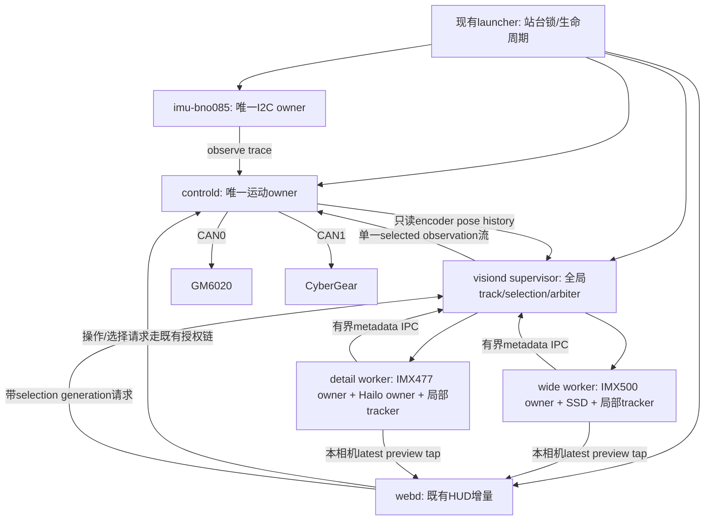
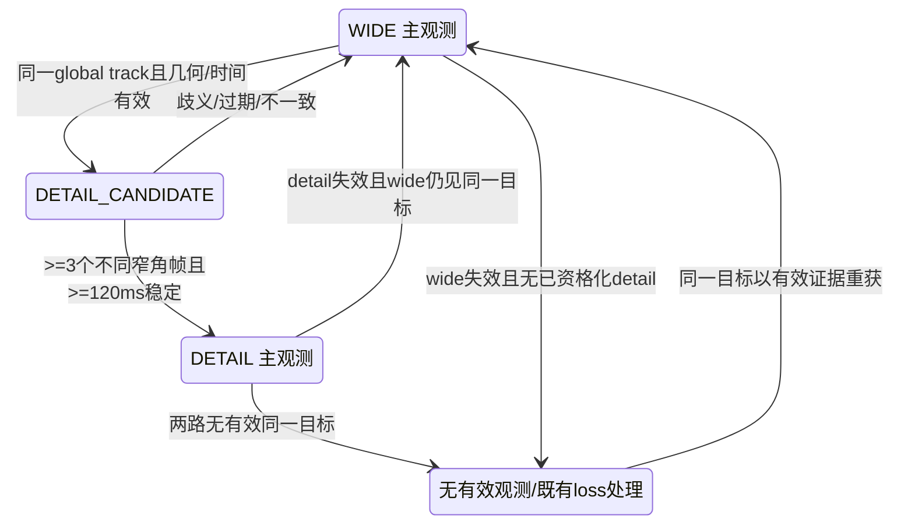

# 02 · 目标架构与决策摘要

除明确标为事实的内容，本章均为本包的设计决策 D。

## 1. 保留的骨架

不重写200Hz控制器、既有tracker、网页和launcher。保持3种正常模式。新增的是逐相机worker、一个全局选择/仲裁层、统一事件记录、可解释停止证据和受控标定身份。

图中的全局选择请求沿既有 `/api/selection` 到最终selector路由迁移，不新增一个绕controller的电机接口。最终命令授权仍在controld。新增图中通道均须经过现有进程所有权设计；不是让Codex直接启动额外常驻daemon。

## 2. 为什么选两个相机worker进程

每个物理摄像头有且只有一个owner。visiond做logical supervisor，不再自己同时持有两相机。两个worker复用现有 `camera.py / pipeline.py / model adapters / track_manager.py`，不是复制两套视觉代码。worker分离使Hailo阻塞/崩溃不会直接堵住IMX500采集，亦适配官方文档给出的逐进程多摄路径。[E2] 现有同进程30帧探针仍是事实，不把官方一般说明误当成“本机同进程绝不可能”。

worker内部最小线程分工：采集callback迅速归还camera buffer；pending-frame深度1；推理线程处理一个in-flight任务，后续仅保留最新待处理帧；预览tap低优先级。局部tracker单写。Hailo只由detail worker一个runtime实例持有。

metadata通过本地、有界消息通道送supervisor；优先复用现有Unix socket编码组件，不引入新中间件。定义消息尺寸上限和背压drop理由。视频不走控制socket，不用JPEG反推控制观测。相机自身buffer_count并不等于应用pending队列深度，不能把驱动buffer数盲目改成1。

默认每worker仅允许2次有退避的恢复尝试；超限标为不可用并保持可诊断状态。重启必须结束旧owner、确认设备释放，再启新generation；保持全局站台锁，不以更换run目录绕过它。控制器不被视觉重启自动重启。

## 3. 单一运动观测仲裁

先完成 `wide_only → dual_shadow → dual_authoritative`，三者是feature stage，不是正常运动模式。

- wide_only：只有经当前配置验证的IMX500观测可供现有闭环使用。
- dual_shadow：两路同步记录/关联/UI叠加，但实际selected observation仍取wide。即使窄角置信度高，也不能改变运动。
- dual_authoritative：同一选定global track、几何/时序有效后，detail可成为构图主观测；wide持续负责外圈覆盖和回退。每个decision只发布一条主观测。

先用**源选择+连续参考过渡**，不用两路bbox直接平均，不假设二者统计独立，不把人体框上部与脸中心当成同一测量模型。融合对象首先是身份、时间与几何一致性；不是先加一个大EKF。

进入detail要求目标落在窄视场内部10%安全内缩区域且测量质量足够；退出使用较小5%内缩与显式年龄判据，形成滞回。以上百分比是初始实验值，不是已调好参数。退出到wide只能继承同一个逻辑目标；不能因为wide只剩另一个人便替换显式选择。

## 4. 保持三模式与选择策略独立

| 层 | 状态示例 | 是否新用户模式 |
|---|---|---|
| 操作者模式 | MANUAL / AUTO_TRACK / AUTO_ROAM | 原有三模式 |
| 选择策略 | AUTO_SINGLE / EXPLICIT_TRACK / EXPLICIT_TAG | 否 |
| 选择状态 | visible / temporarily_lost / ambiguous / revoked | 否 |
| 相机仲裁 | wide / detail_candidate / detail / no_observation | 否 |
| 安全生命周期 | ready / fault / stop_in_progress / stop_incomplete | 否 |

显式选人后策略锁存。目标丢失可以按既有语义停止追随并roam，但不能清掉选择锁存后自动跟随另一个sole candidate。Auto按钮表示恢复服务，不默认等价“取消指定人”；取消/改选必须显式表达。

## 5. 资源预算与降级顺序

200Hz控制线程只处理有界快照、引用、限幅和电机输出；不做JSON文件写入、subprocess、模型推理或阻塞register轮询。编码器和IMU读取在既有异步路径中更新快照。有界日志ring的写端不等待磁盘；丢记录必须计数，使相应验收失效而不是影响制动。

负载不足时依次降低：第二路预览/JPEG → 可选脸ROI检测 → 窄角推理采样 → detail worker。**不降低反馈安全检查、不让control等待两帧配对、不使广角搜索失去持续采样。** 完全电源或控制故障不是性能降级场景，应进入受控停止/不完整停止报告。

不先绑核或实时调度；先记录IRQ/CPU争用和p99。若必须配置 affinity，留出CAN/内核处理能力，以对照测试证明改善。禁止活动站台并发release build；停机后build先限制并行度，主机失联原因不武断归因欠压。
