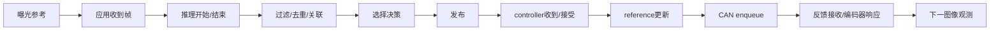

# 04 · 时间、坐标与数据契约

## 1. 契约迁移原则

复用现有 DetectionSet / TrackSet / selected observation 路径。下列结构是N1语义设计，不断言仓库已经使用这些字段。Codex先检查native encoder/parser、长度与版本约束，再两端同release升级；有条件时采用显式capability协商，否则使用严格版本匹配和兼容adapter。未知版本拒绝，不以旧布局猜读。

v1兼容adapter只允许资格化wide路径；缺少camera/model/calibration/selection代际的包不能取得detail授权。一次运行只允许一个selected publisher。socket权限与peer身份沿用项目授权设计，workers不直接连接运动命令入口。

## 2. FrameIdentity与原始时间

每帧最少保留：

| 字段 | 语义 |
|---|---|
| station_session_id / boot_id | 站台会话与主机启动身份；不以墙钟推断 |
| camera_id / camera_generation | 稳定硬件/连接身份与本次owner代际；index不是身份 |
| sensor_mode_id / transform_chain_id | mode、crop、stream、方向的明确指纹 |
| source_frame_sequence / frame_id | 相机自己的序列；不能跨两摄直接比较序号大小 |
| native_sensor_clock / native_sensor_time_ns | 原始metadata时钟和值，不覆盖 |
| sensor_timestamp_semantics | driver定义/已验证含义，未知必须保留unknown |
| exposure_us / frame_duration_us / row_readout_ns | 真实metadata；不支持的值为null |
| clock_epoch / clock_mapping_id | 时钟转换有效期与映射身份 |
| t_observation_ns / observation_time_quality | MONOTONIC的曝光参考与verified/modelled/unknown |
| timestamp_uncertainty_ns | 曝光参考/映射/读取误差界，不用0冒充未知 |
| t_capture_received_ns | 应用收到该帧的主机时刻 |
| t_inference_start/end_ns / t_publish_ns | 处理阶段时刻，不等于曝光时刻 |

**JSON/NDJSON中的所有绝对ns时间与64位frame sequence使用十进制字符串。** C++内部int64、Python int；web端不把ns变成JavaScript Number导致长uptime精度丢失。UI使用相对ms或BigInt转换，UTC只供人类对照日志。

libcamera当前SensorTimestamp规范定义CLOCK_BOOTTIME与首行曝光时刻；这与CLOCK_MONOTONIC不是可以不检查就混用的同一契约。[E3] 本机实际libcamera/driver版本及历史实现可能不同，必须保留版本、读回元数据并做可重复光学验证。

**建议统一：** 应用控制域继续CLOCK_MONOTONIC；并读BOOTTIME/MONOTONIC建立offset与误差界，检查运行前后漂移和跳变。禁止运行期间系统suspend；发生clock jump、boot改变或映射失效时提升clock_epoch并撤销旧观测。不要用NTP/壁钟直接计算控制age。

只有验证sensor timestamp确为曝光起始，才可推导曝光中点：`t_mid(row)=t_start(first_row)+row_readout_offset+exposure/2`。row timing未知时使用明确的参考行/模型与更大不确定度。两相机首行同时曝光也不等于每一行同一时刻。不能一律对所有SensorTimestamp加半个曝光时间。

## 3. 统一事件链与可测指标

frame_id贯穿视觉；decision_id贯穿选择；command_seq关联reference与CAN enqueue；受控step试验有独立experiment_id。一个命令和一条反馈在常规运行中不一定存在可证明的一一因果，不要把自然运动里的最近两条记录当作机械响应时间。

- `capture_to_controller`：曝光参考到controller_receive，仅time_quality可用的记录统计。
- `host_to_publish`：应用取帧到publish，语义较弱但可直接观测。
- `inference`：真实start/end，不包括等待队列；队列等待另算。
- `selected_update_age`：每次controller消费时now−原始观测参考，拒绝旧帧反复刷新。
- `command_to_encoder_onset`：单轴受控step的command enqueue至有持续位置进展；阈值应高于静态位置噪声，不把反馈RX年龄等同于机械延迟。
- `optical_response`：已知外界视觉变化到相机轴开始响应/重新构图；须光学工装或等效外部参考，不能用内部model预测替代。

完整曝光→运动响应预算只能在一次实验里按相容事件计算；不能把各段独立p95直接相加并声称整体p95，也不能在已有曝光→响应时间上再加120ms配置。

统计按camera/profile/mode/load切片，输出p50/p95/p99/max/n、缺失/失序/超期计数。至少1000条完整样本再将p99作为初步性能参考，仍报告连续相关性；模型精度按独立episode/场景切分，不以相邻帧充当独立数据。

## 4. 坐标约定

本包使用 `R_A_B` 把B坐标的向量变到A；`T_A_B`包含相同方向旋转和平移。物理旋转必须proper（det=+1），不能将镜像当成3D旋转。

- `B`：本次安装base/session参考，不代表地理北向。
- `Y/P`：yaw与pitch刚体坐标；零偏与正方向来自本机标定。
- `Cw/Cd`：两相机光学坐标，x右/y下/z前。
- `I`：IMU本体坐标，`W_imu`：游戏旋转向量的相对世界参考，不宣称绝对航向。

`T_B_Ci(t)=T_B_Y(q_y(t)) · T_Y_P(q_p(t)) · T_P_Ci`。

每条观测携带canonical raster身份。保留完整2D变换链 `model → source stream → canonical → preview`；几何计算必须能从canonical反变换回与K/D配套的原始stream，再去畸变得到ray。相机安装旋转由明确的extrinsic描述，preview旋转/镜像不再偷偷改变ray。为兼容现有camera_install，可将其作为明确的2D变换节点，而不是盲目删掉或重复应用。

Hailo当前640×480贴到640×640中心，pad_top=80、scale=1。[R6] 该profile的模型框y坐标必须先乘640再减80后回到480高源图，最后clip并拒绝空框。x/y输出顺序、normalized单位与class index必须逐项验证。换crop/resize后不再沿用固定80。

一个ray不仅有方向，还对应相机中心：`ray_B(t)={origin=T_B_C.translation, direction=R_B_C*ray_C}`。把两ray旋到B并不能消除baseline视差。未知深度不能用一个固定homography把整个wide画面正确映射到detail。

跨摄关联使用实际外参、候选深度区间/epipolar约束及其不确定度；无深度信息时保留可能区域并提高歧义率，不输出假精确点或假距离。立体深度不在N1必做范围。

## 5. 对齐历史与IMU

controld发布只读的有界编码器姿态历史，建议2s/200Hz快照；内部保留实际反馈时间和插值质量，不能把50Hz pitch插值伪称200Hz测量。visiond使用观测对应时刻姿态消除相机自转造成的表观运动；controller再次消费时使用原始观测时间，防止重复补偿。

优先带时间戳插值；无包围样本时只允许≤20ms的显式外推候选，超出拒绝精细交接。该20ms是实验初值。yaw unwrap必须先做编码器连续化，不能跨±π直接线性插值；会话重置必须作废旧历史。

IMU安装在pitch组件。若已标定 `R_P_I`，由 `R_W_I(t)` 与编码器运动链可以构造对base相对姿态的**估计**：`R_W_B≈R_W_I · R_P_I^T · R_B_P(q)^T`。该关系依赖轴零偏、安装旋转和时间对齐，不能直接把IMU读数当base姿态，也不能把IMU与编码器角简单相加。

N1先对比编码器预测相对旋转与IMU相对旋转残差，量化延迟/振动/漂移。50Hz IMU不自动比yaw约1kHz编码器更“快”。只有shadow回放证实改善且generation/tare失效处理通过，才进入独立的IMU补偿实验；默认仍observe-only。重启、reset、tare变化使旧融合状态失效，不在运动中偷偷retare。

## 6. Track/Selection最小语义

local track key = `(camera_id,camera_generation,local_track_uuid,track_generation)`；global track是本次vision session内的关联实体，不是实名identity。Membership允许两相机局部track关联到一个global track，并记录证据、时间与conflict。

选择包含 `target_session_id / selection_generation / selection.policy / global_track_id`。所有异步结果必须匹配当前选择代际；取消再选择同一个人也必须新generation。禁止用track_uuid单独判断异步结果仍有效。

`SelectedObservation`最少包括上述identity、frame/clock/model/calibration身份，anchor位置与来源、person confidence、association confidence、anchor confidence、过期时间及time/geometry qualification。未知质量不能由worker自己补成verified。controller是最终的freshness/selection/calibration/axis权限检查者。

选定观测在schema中可存在但不具运动资格：例如dual_shadow、unknown timestamp、未标定detail。schema合法不等于motion-valid。详见随包semantic checker，其返回仅是离线参考判断。

## 7. UI契约

增量显示：active camera/model/profile、source frame age、selected policy/generation、wide/detail/ambiguous状态、anchor来源、power当前与历史位、IMU generation/tare/fresh、per-axis stop证据、resolved limits及来源。

每个preview tap必须附带同一frame_id/camera generation；overlay只画匹配该帧的框。没有匹配时显示“叠加不可用”，不把最新检测贴到较旧JPEG。浏览器时钟与Pi单调时钟不直接相减；端到端显示时延单独校准或只展示Pi侧capture→tap与浏览器收帧间隔。

## 8. 停止证据

至少发布：`stop_id`、reason、requested_at、stage、每轴feedback_age、stationary_observed、last_neutral_request_at、pitch_disable_requested/confirmed、yaw_zero_requested、yaw_disable_confirmed=null、power_isolated_confirmed=null、completion_quality、missing_evidence。

字段必须区分requested/observed/confirmed/unsupported。stationary只证明该观察窗口未检测到运动，不证明断扭矩。系统不得将两轴布尔disable简单AND后标绿“安全断电”。
