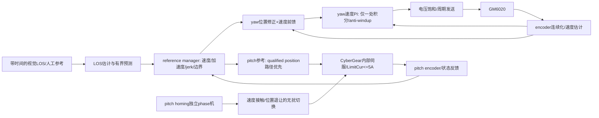
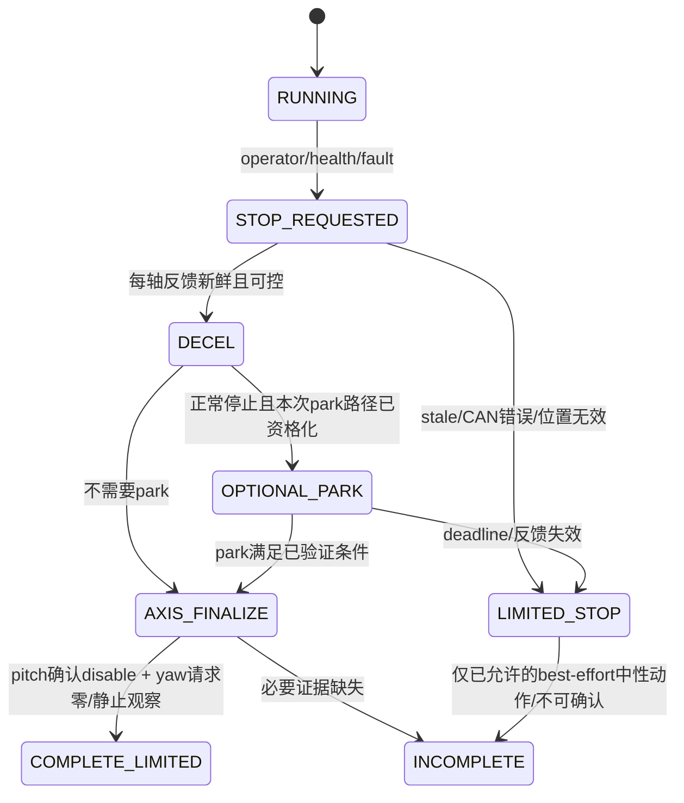

# 05 · 控制、归零、停止与现场测量

本章提出测量与控制结构，不提供未经辨识的新电机增益。旧控制路径先保持，验证后按轴替换。

## 1. 两轴不能共用同一驱动假设

图中yaw PI是目标结构，是否已具备由Codex审计确认。pitch正常position与现有`service_speed_control`可能存在分支，先输出active_drive_mode和积分位置，不能为了符合本图静默改驱动模式。若实测决定保留pitch speed服务路径，则采用host位置P+速度前馈→驱动内部速度环，仍只允许一处负责同一速度误差的积分。

**驱动能力对象：** 至少声明 `has_disable_feedback`、`supports_current_cap`、`feedback_position_valid`、`command_unit`、`periodic_command_required`。GM6020输出单位是raw voltage，不是A或N·m；不把其未标定电流字段换算成已知扭矩。pitch每次reset后配置限流重新写/读回，模式变更是否会使限流失效必须实测/协议确认。

## 2. 有效限幅与停止包络

先报告而非直接修改以下层级：物理/安装资格包络、各轴限制、模式maximum、模式target、人工倍率、reference limiter、驱动饱和。新resolver目标是取各有效硬上界的交集；如当前实现优先级不同，先做回归并明确迁移，不能让“交集改造”突然改变现有正常速度而不报告。

参考速度不应长期顶满actuator速度上限，否则误差修正没有余量。实验可从`target speed ≤ 0.8 × qualified speed cap`开展，但这是**试验候选**，不是本包要求立即改为16°/s。当前实际axis cap需要WP0查清。

停止距离按本机测量建立速度/姿态/载荷查表。`d≈|v|·L+v²/(2a)`只作常加速度初步下界/量级检查，未包含jerk、控制饱和、重力与制动建立时间，不能作为安全上界。实际边界裕量应覆盖经过试验的最坏停止包络、测量不确定性与位置误差；超出已验收速度不外推授权。

## 3. 辨识协议

供电与基本停止前提通过后，在当前已观察过的有效空间内，用现有launcher commissioning功能执行轴分离、连续采集的受控session。pitch保留5A headroom，不每次动作都disable或重启CAN/IMU；只在故障或session结束时按stop流程处理。[R1、U L94–L96]

每个trial保存：installation、load、software/config/model/calibration hash、初始姿态、command/feedback时间、限幅、controller状态。一次只改变一种参数。pitch优先使用已观察过的±15°包络，yaw约30°包络；这不是对未知端点或整圈的授权。靠近边界的测试必须先有对应速度的停止测量。

测序：静止噪声→明确幅度的正反向step/return→不同速度的受限斜坡→移动中受控stop→不同pitch姿态/载荷→视觉闭环。轨迹时长由既有速率约束决定，不要求大角度瞬间完成。

可以对yaw局部工作点拟合`v/u ≈ k·exp(-L s)/(τs+1)`作为辨识起点；静摩擦/饱和附近不满足线性假设，必须报告有效域。pitch按实际接口分别量测position reference→encoder与speed command→encoder，不把内部伺服当已知传递函数。

输出每轴独立的L、τ、增益候选、噪声、饱和区、有效速度域与置信说明；根据回放和实测结果选择最终增益。不要由简单经验公式一次性写入“最终Kp/Ki”。

## 4. 归零抖动分诊

| 数据图像 | 优先怀疑 | 下一步 |
|---|---|---|
| raw velocity乱跳，encoder-window速度平稳 | drive速度字段/量化/时序 | raw只诊断，检查单位与反馈间隔 |
| 差分速度尖峰伴随反馈间隔忽长忽短 | 时间戳/接收批处理 | 使用实际采样间隔和稳健窗口，测窗口延迟 |
| command频繁换向，encoder跟随振荡 | host/drive环叠加或过高修正 | 检查积分位置和无扰切换；单项对照 |
| command平滑、Iq上升、位置停滞后突然滑动 | 摩擦/卡点/负载 | 区分实际触端与静摩擦，不加流绕过 |
| 仅模式切换发生突跳 | 旧setpoint/积分/模式生效顺序 | 新模式目标先对齐当前有效位置/速度，再受限接管 |
| 多次touch端点位置明显不一致 | 接触判据或机构松动 | 不把反复retry最终成功算重复性通过 |

速度估计建议用最近约40–60ms、按时间加权或线性拟合的位置窗口，并输出样本数、有效性和延迟；这个窗口只适合慢速归零的候选指标，不替代快速位置越界、feedback freshness、硬速度/时间保护。不要简单全局平滑所有速度信号。

`stall_velocity_threshold=0.5rad/s`不能独立判断5°/s运动是否停止。接触应同时参考持续位置进展不足、明确的指令推进、可解释的电流/effort证据、motion history、总行程/时间、重复性。电流与effort的单位由驱动解析明确；没有Kt/状态依据就不创造N·m值。

先将现有非致命警告以shadow方式与原始轨迹对照，修正误报根因；真正的位置/反馈/时间/反向失控硬条件保持有效。最终受控归零验收不能依赖`motion_checks_abort:false`吞掉已确认危险事件。若guard误报仍未解释，就不宣告归零qualified。

## 5. 停止状态机与证据

1. stop请求幂等且锁存。重复stop不重置总deadline、不重新开始park，不因为readiness不足连制止输出的请求也拒绝。
2. 反馈不足时**禁止盲目驶向yaw0/pitch40**。按各轴仍可用能力请求中性/已支持的停止动作；失联轴不以旧反馈标确认。
3. pitch disable可能使受载机构下落。只有明确的机械支持/本机已验证姿态/流程允许时才能把disable作为预期完成动作；否则记录限制，不能声称软件可以同时保证断能与支撑载荷。
4. yaw0是会话参考，0电压不是disable。成功停止输出至少分开：yaw_zero_requested、stationary_observed、pitch_disable_confirmed、power_isolated_confirmed=unknown。
5. 正常park与fault stop分开。park不是停止的必要前置动作；发生健康故障不能为了“回零”继续额外行程。
6. launcher保留所有权并等待控制器按现有流程结束；caller等待120s超时不代表控制器可以被force-kill。显示stop_incomplete与缺失证据，由现场按运行手册处理。

软件进程死亡或Pi掉电后不能假定仍能发送零命令。没有独立断能/机械支撑证据，本阶段不能取得无人看管运行资格。该限制不阻碍可见、受控的有界commissioning。

## 6. 故障注入先后

先mock注入：feedback100ms以上、错误frame type、重复/倒退时间戳、饱和、I2C generation变化、camera worker退出、Hailo超时、stop过程中状态缺失、history-only与当前欠压。回放通过后才做现场允许的故障试验。

现场拔CAN、掉电、controller进程丢失、端挡压迫等不能仅因“测试列表里有”就执行；须已有机构支撑与独立处置方案。若前提不存在，将测试标为not-run并保留无人值守禁用，而不是虚构pass或直接跳过风险说明。
