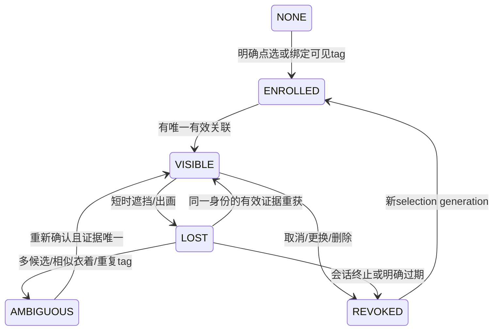

# 06 · 双摄、标定、模型与身份方案

## 1. 两路分工与模型选择

N1基线固定：IMX500 / person_detect_available / SSD作为wide；IMX477 / hailo_yolov8n作为detail。不是用窄角取代广角，而是保证wide持续搜索，detail在同一已选目标和有效几何条件下改善构图。所有改动先dual_shadow。[U L79–L82；R4–R6]

Hailo既有artifact：`hailo_yolov8n_coco_hailo8_v2_17_0`，架构HAILO8，runtime记录4.23.0，SHA256 `e893b0f9dcae366fe1bc9ebce25e32ad889acf2bc58cfe1f73a572f78f7ec055`。当前manifest声明AGPL-3.0；记录该声明及来源，不把它扩大成整个部署的法律合规结论。[R6]

首轮保留RGB640×480/15Hz、640×640输入。确认色序与设备NMS；manifest阈值0.5和tracker低阈值的关系是WP5必须实测的项目。没有可用低分框时，BYTE low association分支可能事实上无输入。

新增脸定位：优先**小范围、可关闭的YuNet selected-ROI CPU实验**，先固定已安装OpenCV版本可用的模型，读取并记录模型字节SHA与许可证。现阶段没有本机性能数据，不承诺YuNet的Pi速度。不得运行“安装最新OpenCV”来替换系统camera绑定。[E6]

YuNet不提供跨会话人脸身份，也不能检测所有背面头部。它的输出只叫face_box/face_center；真正head_box需另一个经过本机质量与运行时验证的模型，N1只预留接口，不造一个不存在的已合格HEF。脸实验失败时body tracking仍完整工作。

模型分发：由已提交manifest指向固定artifact；在独立release构建/预检环节验证SHA、shape、labels、architecture/runtime；权重存在忽略的运行缓存，release只引用验证后的内容。升级模型单独版本化，有独立质量数据；缺artifact使该profile不可用，不现场silent下载任意latest。

## 2. 标定工装

使用贴在刚性平板上的ChArUco板，记录棋盘参数、dictionary、实测格长/标记长和打印是否等比例。工具/库版本固定；按本机OpenCV API实现，而不是默认最新教程API已安装。[E4]

为窄角准备能在选定工作距离填充视场的板；可使用不同大小、都经实测的板做单摄intrinsics，但相机间外参必须有同一已知坐标目标的共同观测。无需购买新电机、镜头或测距器作为首阶段前提。

建议辅助：固定三脚架/标定平面、可见闪烁LED或屏幕图案作光学时间验证、量尺测相机baseline与标签边长。LED测试仅用于成像时序，不是瞄准/照射载荷；本项目保持相机/传感器用途。

## 3. 校准顺序

**A · 身份与成像配置。** 枚举稳定camera identity与连接位置，保存model/mode、raw尺寸、stream尺寸、ScalerCrop、resize、orientation、曝光策略、镜头焦距/对焦记号。index0/1只供本次枚举，不作为永久身份。

**B · 单摄K/D。** 每个实际生产mode采集25–40个有效不同位置/倾角画面，覆盖边缘和多个尺度；独立留出不少于10组未参与拟合的视角。拒绝严重模糊和退化同平面同角度样本；输出每帧误差而不只平均值。更改sensor crop、stream、对焦或安装后重新验证对应calibration identity。

**C · 相机间外参。** 保持云台静止，让同一刚性板在共同可见区出现，多位置、多距离。分别PnP后求相机间刚性变换，多组优化并保留独立集。实际baseline与光轴数据必须一致；别把几厘米偏置强行拟合成纯旋转。

**D · 相机到轴。** 在已资格化有界行程内，固定环境标定板、逐轴运动并记录编码器与图像位姿，拟合零偏、旋转轴方向、旋转中心及camera-to-pitch刚性变换。yaw会话参考与绝对朝向分开；不以相机间标定替代电机轴标定。

**E · IMU安装。** 与编码器运动链比对，通过多个非共线受控运动估计R_P_I与延迟。相对tare不是安装标定，只有单轴数据无法充分辨识所有旋转自由度。无需把这一任务作为dual_shadow软件开发前置条件。

**F · 时间/动态留出验证。** 分别验证时钟映射、曝光参考与rolling shutter影响，再验证运动时wide→detail预测区域、回退和相机自转补偿。静态低重投影误差不能代替动态验证。

输出calibration manifest和资格报告；原始图片/视频只在明确同意的测试采集中保留到忽略目录，不能自动提交Git。默认运行只记录数值。

## 4. FOV、像素与视差的规划

FOV从该mode的K/D及有效边界射线求得。名义IMX477全幅14.33°×10.77°和旧IMX500约69.2°×40.4°只说明“窄角明显更窄”，不能写进新控制标定。[U L52]

规划时可用 `pixels≈f_px·物体横向尺寸/距离`；其中f_px必须来自实际流，物体尺寸/距离是声明的试验假设。选2m、5m、10m等可实际测试分箱，测person/head/face/tag像素、召回率和模糊，不根据名义焦距宣称10m能认脸。

窄角ROI不止取wide预测点：应包含calibration残差、未知深度视差、相机/目标运动、曝光时差带来的不确定区域。`角误差≈角速度×时间误差`是小角度量级检查，例如20°/s×25ms=0.5°；它不是当前误差实测。

## 5. 异步匹配与交接

wide与detail各自连续工作，不为配对阻塞。诊断匹配可先用|Δt|≤30ms作为窗口，再依实际motion uncertainty调整；配对失败记unpaired，不堵采集。

global关联分三级：同一明确tag证据；已选local track的运动/几何连续性；弱衣着/外观辅助。几何不合理时不能靠高appearance score硬合并。两相机都看到不同候选或同tag重复时标ambiguous。

detail接管条件：同一target session和selection generation，time/geometry有效，anchor关联唯一，≥3个不同detail帧且≥120ms稳定，目标处于内缩视场，当前age≤100ms。切源不是重新选人，故不重复500msAUTO_SINGLE dwell；也不能因此跳过初始确认。

切源前以同一anchor定义计算两源残差；从body_upper到face_center是构图策略变化，不能当作追踪误差直接放大。参考目标用既有jerk limiter连续过渡，真实旧结果仍保留旧timestamp，不用平滑制造“新观测”。

## 6. 指定目标生命周期

AprilTag family+id是标签身份，不是人脸身份或不可伪造凭证。绑定人的条件是tag与person空间/时间关联唯一。标签可转移或复制；发生复用/多人同时佩戴同ID时必须拒绝自动确定人物。

默认会话内存存储，关闭持久appearance/face embedding。短遮挡可用已有motion/IoU/弱颜色续接，但不能宣称长时间离场后仍确定同一人。销毁target session时清除局部映射与缓存并使异步结果失效；显式target锁存不因AUTO_ROAM而消失。

## 7. 锚点与无脸降级

脸定位要先有selected person的ROI。多个人体框重叠时，仅“脸在某个框里面”不够；使用最一致父track与竞争排除，否则输出anchor unavailable。person_score、association_confidence、anchor_confidence分别显示。

优先使用可见且新鲜的face定位；仅有身体时返回带来源标签的body_upper/torso。没有可信anchor时输出无观测，交由既有coast/hold/loss机制；不无限外推头部位置。actor目标身份不因为脸不可见而变成另一人。

脸ROI推理可以比person低频，但不能复用结果时刷新timestamp；age超门槛就退身体。模型执行预算以实际profile定，超时直接丢弃该可选结果，不拖住person管线。

## 8. 数据集最小覆盖

空景；单人静止/横移/靠近；多人交叉；相似衣着；body可见而脸不可见；多脸/部分脸；tag遮挡/反光/重复ID；两视场往返；低照/逆光；Hailo故障；相机重启；不同距离与pitch姿态。

标注person框、可见face/head类别及不可见状态、tag ID、物理episode目标、跨摄匹配、遮挡时段。按episode/拍摄session分训练调参与保留测试，不把同一视频的邻帧分散到两边造成泄漏。报告支持域与不支持域，不用“总体90%”掩盖某个关键距离完全失效。
