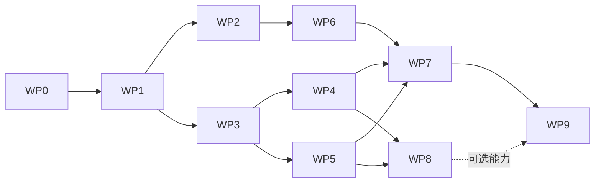

# 07 · Codex任务拆分与迁移顺序

## 1. 阶段边界

**N1-A（立即开发）**：WP0–WP2。新增可解释的配置/时序/停止与归零诊断；不换主相机或调增益。

**N1-B（可并行的软件主线）**：WP3–WP5。双摄owner、协议/回放、标定工具和模型质量工具，以mock与dual_shadow推进。

**N1-C（需要现场证据）**：WP6–WP7。混合控制改进、受控双摄交接、标签会话目标。每个能力只按它的证据升级，不因另一个能力已pass而跳过。

**N1-D（独立可选实验）**：WP8。IMU补偿shadow、YuNet脸ROI与UI信息补齐。其失败不阻止已合格person/wide功能交付。

**发布收口**：WP9。正常模式/启动默认保持项目约定，显式试验开关不误入生产。

## 2. 任务表

| WP | 交付内容 | 优先触及的现有路径/符号 | 前置 | Done / 不做 |
|---|---|---|---|---|
| 0 | HEAD、resolved profile/config、capability报告；单位/覆盖规则测试 | config/mixed_hardware.yaml、turret_mixed.yaml、control/src/config、main.cpp、launcher | 无 | 解释实际active mode/limits；不改物理增益 |
| 1 | trace envelope、时钟映射、frame/decision/command lineage、有界recorder、统计工具 | perception/camera.py、pipeline.py、visiond.py；control/src/main.cpp与已有IPC；tools | WP0 | mock链完整、缺失/失序不伪造统计；不以JPEG作控制源 |
| 2 | stop证据分轴、readiness拒绝回归、homing phase记录、shadow/hard guard分类 | control_loop.cpp、homing_controller.cpp、homing_motion_guard.hpp、safety_supervisor.hpp、launcher | WP0/1 | stale时可请求停止但不盲park；不调高5A/超温/反馈阈值 |
| 3 | 双worker生命周期、稳定camera ID、generation、per-camera tracker、latest tap | visiond.py、camera.py、pipeline.py、tracking/track_manager.py、webd tap | WP1 | mock Hailo挂死不堵wide，owner重启隔离；不启用detail运动 |
| 4 | mode-bound calibration manifest、采集/标定/验证工具、只读pose history、变换测试 | calibration/、camera_install.yaml、tracking/、controller与vision协议 | WP1/3 | 原始/模型/预览坐标闭合，未知标定拒绝资格；不伪造FOV |
| 5 | Hailo manifest单一事实、NMS/label/色序检测、离线精度评估 | perception/model/hailo_yolo.py、model/manifests、config/hailo_yolov8n_manifest.json | WP1/3 | 实际返回分数分布可解释；不切最新YOLO或安装全套Hailo |
| 6 | 单轴辨识、无扰模式切换、anti-windup、停止包络、homing guard根因修复 | speed_servo.hpp、reference_manager.hpp、homing与CAN backend | WP0/1/2 + 现场资格 | 每轴/方向/载荷数据支持；不继承旧机构验收 |
| 7 | global关联、arbiter、显式selection锁存、AprilTag enrollment与冲突 | tracking/、selection路径、native observation与controller接收、/api/selection | WP3/4/5；运动另需WP6 | 同一目标交接/退选/失联通过；不是持久身份识别 |
| 8 | IMU residual/shadow开关、可选face ROI、UI来源/年龄/停止状态 | imu_trace_ingest、imu observer、model adapter、webd/app.py与dashboard.py | WP1/4；脸需WP5 | 开关关闭不影响person基线；默认无IMU控制影响 |
| 9 | migration、兼容性/回归、资格报告、模型/标定/配置固定与回退 | tests、deploy_station.py、run_application.sh、现有docs | 按发布范围 | 只有证据支持的能力启用，历史/未运行项可见 |

表中路径相对 `Firmware/`（除仓库AGENTS等）。这是基于交接书的定位表，不保证符号在未来分支不移动。Codex使用本地 `rg --files` / 符号搜索定位，不为这些任务全盘重构。

## 3. 依赖图

电源修复与静态负载验证是一条现场工作线，并不阻断WP0–WP5的离线部分；必须阻断不合格条件下的实际自动运动。不要把整个N1写成必须依次等待硬件的巨大串行任务。

## 4. PR边界和验收证据

每个PR以一个行为变化为单位。推荐首个PR仅新增resolved-config报告与单元测试，第二个PR新增事件契约/recorder和synthetic replay，第三个PR修stop证据并覆盖旧readiness失败。dual worker、native v2、control tuning、模型升级分别独立。

有native ABI变化时，serializer/parser/版本拒绝/兼容adapter在同一PR；有配置字段时，schema/默认值/解析后遥测/测试一起提交。仅新增日志的PR也必须检查200Hz线程是否发生阻塞或分配尖峰。

每个WP报告四类测试：静态/单元、mock/replay、camera-only、现场motion。未执行写NOT_RUN并给原因；不要拿包内unittest结果代替仓库tests。旧77个回归通过是历史事实，不代表当前全套已经通过，WP0先运行并记录当前实际suite。

## 5. 发布迁移

S0保持已有mixed single-camera基线；S1协议与diagnostics可用但行为不变；S2双摄shadow；S3单轴控制改进分别通过；S4允许资格化detail仲裁；S5按独立实验结果启用标记/脸/IMU的相应能力。

每次配置变更带schema与content hash，写入运行开始事件。试验开关在normal release默认关闭，除非已通过该功能资格。配置缺失/未知值不默认开启增强能力。

回退使用同硬件、同协议配套release。摄像头enhancement可回退wide-only；电机与供电问题不能靠换回一个旧release自动恢复运动。详见09。
