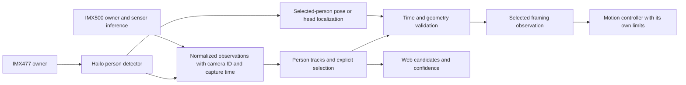

# Plan: Hailo-assisted people and head tracking

Status: **Hailo provisioning and a first camera-to-inference probe are verified;
production perception integration and accuracy evaluation remain proposed**.
Updated 26 September 2026. Uses the [verified hardware inventory](HARDWARE_CURRENT.md).
Motor integration and continuous-yaw readiness are separate gates in the
[hardware adaptation plan](HARDWARE_ADAPTATION_PLAN.md).

## Requested behavior and scope

Detect people separately from other objects, locate a visible person's head for
camera framing, and keep following an operator-selected person. For finding the
selected person again, use session-local track continuity, motion and temporary
non-biometric appearance cues such as clothing color. This supports searching
for the selected subject during the session; it does not establish a person's
real-world identity or recognize them across sessions. Similar clothing or a
long off-screen interval can make the answer uncertain. Show that uncertainty
and request reselection instead of substituting a different person.

Separate three outputs: **person classification**, **head localization**, and
**selected-track association**. A high person-class score does not establish
head position or identity continuity. Head/pose geometry is used for framing,
not biometric identification. Persistent face galleries and biometric matching
are outside this plan.

## Baseline and recommended architecture

The launcher currently defaults to `person_detect_available`: IMX500
SSD MobileNetV2 FPN Lite 320 x 320, configured at 26 inference Hz. The JSON's
standalone default `person_detect` instead names YOLO11n PP, 640 x 640 at 16 Hz,
with uncommissioned thresholds. Record the actual launched profile, model hash
and settings in every comparison; neither configured rate is an achieved rate.

`perception/model/adapter.py` supports IMX500 and mock adapters. The camera
factory in `perception/camera.py` constructs IMX500 and uses its camera index.
Hailo needs an explicit new adapter and a generic camera-provider boundary.
Keep the current normalized detections, BYTE-style association, UUID selection,
latest-only preview and sensor-time contracts wherever they remain suitable.

Recommended experiment: retain IMX500 as the baseline/person search stream and
evaluate IMX477 + Hailo as a person/head-detail stream. Determine their final
roles from measured lens FOV, head pixel size, blur and inference quality. The
IMX477 sensor has 4056 x 3040 pixels; its actual lens determines whether it sees
a narrower view. Resolution alone does not establish that it is the detail
camera. [Raspberry Pi camera specifications](https://www.raspberrypi.com/documentation/accessories/camera.html#high-quality-camera).

Current executable evidence is a single-camera probe, not application
integration: the minimal Hailo-8 runtime survives reboot, the project venv
imports HailoRT, and a real IMX477 stream produced finite YOLOv8n outputs with
valid capture timestamps. Thirty 640 x 480 RGB frames ran at 15 fps after
letterboxing to 640 x 640; inference p50/p95 was 6.86/7.05 ms and
sensor-to-result p50/p95 was 20.99/21.69 ms. No box reached 0.5 confidence in
the current view, so these timings say nothing about person accuracy or useful
recall. The camera was released after the probe. The HEF and raw run artifacts
are retained only under ignored `run/hailo-probe/`; a repeatable probe script
and configuration manifest are now available in `Firmware/tools/probe_hailo_camera.py`
and `Firmware/config/hailo_yolov8n_manifest.json`.

This is a staged design: first prove one Hailo camera path. The diagram's
cross-camera combination is enabled only after time and geometry validation.
Each camera has one owner; web preview consumes those owners' frames.

The installed BNO085 is an additional motion observation source, subject to
the acquisition/mount/calibration gate in the hardware plan. It does not increase
detector class accuracy by itself.

## Phase A: provision and prove the accelerator

The minimal Hailo-8 stack is now provisioned on the existing
`6.18.39+rpt-rpi-2712` kernel: DKMS 3.2.2, HailoRT and
`hailort-pcie-driver` 4.23.0, and `python3-hailort` 4.23.0-1. The package
transaction added 8 packages and upgraded/removed none; `hailo-all` and Tappas
were not installed. After reboot, `/dev/hailo0` returned, `hailortcli
fw-control identify` reported HAILO8 firmware 4.23.0, and the project venv
import worked. This satisfies basic device/runtime identification for this
kernel, not long-run health or production service integration. A repeatable
`Firmware/tools/probe_hailo_camera.py` and config manifest are being added.
[Official Pi setup and package compatibility](https://www.raspberrypi.com/documentation/computers/ai.html).

Use project-local environments for added Python dependencies, with system camera
and supported OS-packaged Hailo bindings available (for example, a compatible
venv created with `--system-site-packages`). Run both the Hailo binding import
and a real inference through the **same interpreter the launcher selects for
production visiond**, including any `OTA_PYTHON` choice. Record that interpreter,
binding path/version and native runtime version; a system-Python-only demo does
not establish that the project venv works. Keep package/HEF versions matched, record the resolved
versions, and fail clearly on incompatibility. Prefer precompiled vendor HEFs
for the first executable probe. Hailo Model Zoo **v2.x** and Dataflow Compiler
**v3.x** target Hailo-8/8L; current Model Zoo master targets newer hardware.
Compile custom models on a supported development host only when necessary.
[Official Model Zoo compatibility notice](https://github.com/hailo-ai/hailo_model_zoo).

**Basic runtime exit passed:** the runtime identifies HAILO8 and a real camera
pipeline produced finite outputs using a compatible recorded HEF. The repeatable
probe/manifest and sustained-run checks remain. PCI identity and the 26 TOPS
rating alone do not pass this gate.

## Phase B: choose models using representative evidence

An official Hailo Model Zoo 2.17.0 YOLOv8n HEF has now run on the HAILO8 device
as an execution candidate. SHA-256:
`e893b0f9dcae366fe1bc9ebce25e32ad889acf2bc58cfe1f73a572f78f7ec055`.
The 30-frame hardware benchmark reported 3.36 ms inference latency. The real
IMX477 pipeline measurements above are useful for timing only; no output reached
0.5 confidence in the current view. No person/head accuracy has been measured.
Continue with a compatible Hailo YOLOv8m person detector and a smaller model
comparison on representative labelled scenes. Hailo's Pi examples include H8
detection and pose pipelines; these are starting points for evaluation, not
station acceptance.
[Official Pi example pipelines](https://github.com/hailo-ai/hailo-rpi5-examples/blob/main/doc/basic-pipelines.md).

For head position compare two approaches: a person pose model with confident
head-related keypoints, and a dedicated head detector applied to the selected
person's crop. Official Hailo pose examples include YOLOv8s/m pose. Keypoints
such as nose/eyes/ears are geometric measurements; they do not directly specify
an anatomical head center, and back-facing heads need a tested fallback. A
dedicated head model requires its own compatible export/HEF and quality evidence.
[Official Hailo pose example](https://github.com/hailo-ai/hailo-apps/blob/main/hailo_apps/python/standalone_apps/pose_estimation/README.md).

Build a labelled evaluation set with small/distant people, standing/sitting,
front/profile/back views, hats, partial heads, occlusion, people crossing,
similar clothing, fast motion, indoor low light and bright backgrounds. Include
empty scenes and difficult non-person negatives such as chairs, displays,
posters and human-shaped objects. Split tuning and acceptance scenes; report
counts and uncertainty, not just a single average score.

Compare models on the same images where the execution paths support replay.
For sensor-only inference, use repeated controlled scenes and document the
unavoidable capture difference; do not label two unrelated live streams an
identical-input comparison. Separate detector accuracy from tracker behavior.
The existing `perception/replay`, `tools/bakeoff.py` under `perception/`, and
commissioning tools are useful starting points.

Record model origin/license, checksum, target architecture, runtime/compiler
versions, input dimensions/layout/color, quantization, label indexing, outputs,
NMS location and thresholds in a manifest. Tune thresholds independently per
model. A larger model is selected only if the measured quality gain justifies
its capture-to-observation delay and resource cost.

**Exit:** chosen detector/head strategy beats or usefully complements the
measured baseline on the held-out set. No FPS or accuracy uplift is assumed.

## Phase C: integrate one camera and correct head geometry

Add a Hailo adapter behind an experimental profile. Separate capture from
inference and preview; bound every queue, drop stale work and release camera
buffers promptly. Avoid blocking motor control on Hailo scheduling. Preserve
sensor timestamp, host receipt time, frame sequence and camera identity across
asynchronous inference and reject delayed/out-of-order results.

Reverse letterboxing/cropping/resize exactly once. Carry the active sensor crop,
orientation, stream dimensions and intrinsics through detection to LOS. Verify
color order and model label mapping with real frames before trusting scores.
Expose preprocessing, inference, postprocessing, tracking and publication
timings separately. Integrate through the existing detection/track protocols;
version those protocols if camera IDs, anchor provenance or uncertainties need
new fields. Do not change packet layouts without both ends accepting the version.

The current `tracking.aim_point` at 0.22 of a person box and the existing
shoulder/torso anchor are not measured head detections. Add explicit sources
such as `head_box`, `head_keypoints`, `torso_fallback`, with visibility,
confidence and capture age. Keep person association based on the body track
while using the head point only for framing. Reject a head that belongs to a
neighboring person's overlapping box. On missing/occluded head, transition
smoothly to a labelled torso fallback or hold; do not extrapolate indefinitely.

**Exit:** real Hailo observations traverse the production pipeline into replay/
simulated control; overlays agree with pixels and calibrated rays; stalls and
bad geometry cannot produce a fresh selected observation.

## Phase D: keep the selected person through short interruptions

Reuse selected UUID protection and motion/IoU/scale gates. Evaluate the existing
`tracking/appearance.py` upper/lower-body HSV descriptor as a low-weight
association cue, in memory only and expiring with the track. Keep person score,
association confidence and head-point confidence distinct in UI and telemetry.
No persistent identity store or face embedding is needed for this workflow.

When the operator explicitly selects someone, latch that selection policy.
The current `AUTO_SELECT_SINGLE` must not silently choose the next sole person
after the selected one disappears. Roaming/search can resume while selection
is retained for its bounded lifetime. A plausible short-gap return must pass
motion, time and ambiguity checks; two similar candidates means no reacquisition.
After expiry, report selection lost and require a new operator selection for
this mode. Separate this from the normal optional automatic-any-person mode.

**Exit:** crossing/occlusion trials show no observed target steals; ambiguous
and expired selection states are visible and cannot silently redirect tracking.

## Phase E: add the second camera only for a measured benefit

First run concurrent independent pipelines and measure CPU, memory bandwidth,
thermal throttling and observation age. The September 26 30-frame test proves
basic dual capture only. Pi supports concurrent cameras, but exposure and 3A
are not automatically synchronized; software sync is not exact simultaneity.
[Official multiple-camera guidance](https://www.raspberrypi.com/documentation/computers/camera_software.html#use-multiple-cameras).

Commission per-camera intrinsics/distortion, crop/orientation and rigid mounting
extrinsics. Determine whether both cameras move with the head and test mounting
flex at representative pitch/yaw. Pair observations by measured timestamp skew
and sensor exposure, not arrival time. Account for each sensor's rolling-shutter
and exposure contribution during motion.

Different optical centers introduce range-dependent parallax. Without depth,
a 2D box in camera A is not a unique pixel or ROI in camera B; use calibrated
ray/epipolar candidate gating or a validated limited-range approximation with
uncertainty bounds. Do not assume stereo depth or a universal homography. First
use camera B as independently checked corroboration/detail for a selected
candidate in overlapping view. Missing, stale or ambiguous correspondence
produces no refinement. Do not merge independent camera UUIDs by numeric ID.

**Exit:** the extra stream measurably improves person recall/head localization
without stale observations, duplicate people or false cross-camera association.
Otherwise retain one motion-authoritative stream and a secondary operator view.

## Phase F: use the IMU to distinguish camera motion from subject motion

After observe-only validation, interpolate calibrated BNO085 orientation/rates
to each camera's sensor timestamp and project camera rotation into the image.
Use this as a motion-compensation hint for the existing
`perception/tracking/camera_motion.py` path, combined with encoder kinematics.
This can improve association while the camera pans and help estimate subject
motion; measure that effect instead of assuming an improvement.

Carry validity, status and age with each IMU hint. The observed rotation-vector
accuracy status of zero is not suitable for authoritative orientation. A short-
term gyro/game-rotation estimate may be evaluated after bias/timing checks;
its yaw drift prevents use as a guaranteed global heading. Inertial rotation
does not remove parallax, translational image motion or rolling-shutter effects.
Do not feed the same encoder evidence into an allegedly independent IMU check.

Compare labelled pan/tilt replays with and without IMU compensation, measuring
ID switches, angular framing error and head-anchor jitter. Drop stale/bad hints
and retain the existing visual/encoder fallback. No automatic tare, persistence
or motion-control authority is introduced by this perception feature.

**Exit:** measurable association/framing benefit with no target steals or
regression during sensor dropout, magnetic disturbance or timestamp faults.

## Acceptance and performance gates

The existing [perception architecture](open_auto_turret_perception_target_selection_architecture_v1.md)
provides initial tracking gates. Keep the following measurements distinct:

| Measure | Proposed acceptance approach |
|---|---|
| Person precision/recall | Report by range/head size, light and occlusion on held-out labels; improve the selected failure cases without degrading agreed baseline cases |
| Empty-scene selectable people | Aim for zero; existing initial maximum is fewer than 1 per 10 minutes |
| Duplicate visible candidates | Existing target below 1% |
| Selected-person continuity | Zero observed ID switches/target steals in crossing set; retain selection through 300 ms occlusion in at least 95% of trials |
| Head localization | Report median/p95 head-center error normalized by labelled head size and in calibrated angle; proposed initial p95 below 25% of head-box diagonal for visible heads, subject to scene commissioning |
| Head unavailable | Every fallback labelled; zero fresh-head claims from stale/occluded measurements |
| First valid detection to selectable | Existing preferred p95 <=250 ms; measure separately from automatic selection dwell |
| Actual automatic acquisition | Report full exposure-to-selection and selection-to-motion delay; current 500 ms single-candidate dwell cannot meet a 250 ms automatic-acquisition target unchanged |
| Latency and throughput | Capture-to-publication p50/p95/p99, achieved inference/publication rates, queue age and drops for each camera/model; no growing backlog |
| System load | Sustained dual-camera/Hailo run, including motor control once commissioned; no controller deadline/watchdog regression or unexplained CAN drop growth |
| IMU contribution | Compare compensation enabled/disabled; only calibrated, correctly timestamped hints may be used, and bad/stale IMU data must revert visibly to the validated fallback |

Historical IMX500 sensor-to-publication measurements were median 58.34 ms /
p95 73.87 ms with approximately 38 ms exposure. They belong to the previous
station and provide a comparison method, not an acceptance result for this one.
See [latency analysis](latency_bottleneck_analysis_2026_09_08.md). Measure optical
scene-change-to-correct-observation separately; accelerator inference time alone
does not include exposure, queueing, confirmation or mechanical response.

Release in order: camera-only benchmark -> replay/simulated control -> bounded
Manual tracking after motor commissioning -> operator-selected search -> normal
automatic operation. Keep the IMX500 fallback explicit and report its reduced
capabilities if Hailo fails. Switch camera/model only through a controlled reset
of geometry/track state; never silently substitute a stream with different
calibration. Store runtime datasets outside Git and preserve approved versioned
model/profile manifests with the release.
