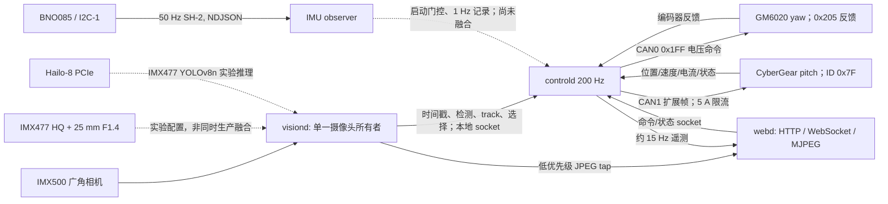

# OpenAutoTurret 当前架构与架构师决策交接书

**基线：2026-09-27，`codex/hardware-adaptation` 分支；当前站台版本 `f8bcdb6`。** 本文描述当前仓库与已观察的站台，不把旧双 CyberGear 的物理验收结果移植到新硬件。架构师可直接读取 GitHub 分支中的相对路径；Pi 上的 `run/` 捕获、日志、HEF 和本地工作区文件不在 Git 中。现场操作以 [STATION_OPERATIONS.md](../../../STATION_OPERATIONS.md) 为准。

**当前运行状态：站台在 MANUAL/HOLD，控制器无故障。** `8901808` 曾在负载运行时报告欠压/节流 `get_throttled=0x50005`。操作者把 Pi 输入提高到 5.25 V 后，约 5.5 分钟 IMX500/CAN/IMU 自动运行、IMX477/Hailo 60 帧独立运行，以及站台运行时的 release 构建都观察到 `get_throttled=0x0`；PMIC EXT5V 实测约 4.87–5.11 V。双摄+Hailo+电机同时的峰值负载尚未验证。`f8bcdb6` 完成归零并达到 READY；Web 命令接口的持续 D-pad 测试证实 yaw/pitch 可动，但 pitch 释放后过冲尚未解决。Web 命令测试并非浏览器指针事件验收。

## 1. 事实等级与系统边界

| 等级 | 含义 | 本文中的例子 |
|---|---|---|
| 已现场观察 | 此配置或短时行为在当前 Pi/机构上出现 | 两路 1 Mbps CAN、±15° pitch/约 30° yaw、双摄 30 帧短探针、IMU 相对角、正常 IMX500 自动模式、三次受控停止观察 |
| 已实现，未充分验收 | 有代码和有限探针，但缺少目标场景/持续运行/故障验证 | 5 A 读回、pitch homing guard、停止反馈时序、Hailo visiond 60 帧、IMU 自恢复 |
| 设计待决 | 不得当成当前能力 | 双摄同步融合、跨镜头身份、头/人脸检测与指定人识别、IMU 控制融合、有效光学标定 |

平台只有一个运动命令所有者：C++ `controld`。Python `visiond` 提供目标观测，Python `webd` 提供显示与操作，独立 `imu-bno085` 提供观察；全栈由 [run_application.sh](../../../../scripts/run_application.sh) 管理。`webd`/`visiond` 不直接发 CAN。默认服务循环是 AUTO_ROAM → AUTO_TRACK → 丢失后 AUTO_ROAM；Manual/Hold 是操作者显式覆盖。旧 `Firmware/vision/` 单摄代码与旧 systemd 服务不是当前 launcher 的正常视觉路径。

图中虚线表示实验或尚无控制权。`webd` 预览优先读取 `visiond` 单帧 tap，以免重复打开同一摄像头；源码中的懒加载独立采集后备路径不能作为双摄架构。图像帧不走控制遥测 socket。[launcher](../../../../scripts/run_application.sh)、[控制入口](../../../../control/src/main.cpp)、[视觉入口](../../../../perception/visiond.py)、[网页入口](../../../../web/webd/app.py) 给出进程级事实。

## 2. 物理硬件、拓扑与校准现状

| 部件 | 当前配置/证据 | 仍需确认 |
|---|---|---|
| 主机 | Raspberry Pi 5 Model B Rev 1.1；`eamars@rpi-turret`；当前 Pi 驱动 `mcp251xfd`；操作者将输入调至 5.25 V，已观察负载下 `get_throttled=0x0` | 供电型号、线缆压降、HAT 电源路径、双摄+Hailo+电机峰值裕量仍需量化 |
| CAN HAT | 操作者报告 Waveshare 2-CH CAN FD HAT Rev2.1；两个 MCP2518FD，40 MHz；系统 `spi0.0`/GPIO25→`can0`、`spi1.0`/GPIO24→`can1`；设备树启用 SPI、`spi1-3cs` 与两份 `mcp251xfd` overlay | HAT 标签、布线/终端、滑环电气额定值；CAN FD 硬件存在但电机通信是 1 Mbps **经典 CAN** |
| CAN 启动 | `ota-can-links.service` 已安装、启用；下一次观察到的重启后于 monotonic 5.76–5.82 s 完成，两路 UP/ERROR-ACTIVE/1 Mbps | 已通过一次重启，但长期恢复可靠性未验收；服务不打开电机传输 |
| yaw | GM6020，直驱，`can0`，电机 ID 1；标准反馈 `0x205`，组合电压命令 `0x1FF`；滑环、无 yaw 端挡，可连续机械旋转 | 电流/扭矩限制、完整整圈安全性、真实断能状态；0 电压请求不等于 disable |
| pitch | CyberGear，直驱，`can1`，出厂 ID `0x7F`，唯一 ID `7216313130333105`，操作者确认固件 **1.2.1.5**；有机械端挡 | 端点和负载长期验证；**`LimitCur` 最高 5 A**，写入/三次读回后才使能；读回不证明瞬态峰值 |
| 广角相机 | IMX500；审计时 index 0；正常 `person_detect_available` 传感器端 SSD MobileNetV2 FPN Lite 320×320，约 26 Hz | index 不是永久身份；本次机构的内/外参、检测召回率 |
| 细节相机 | IMX477 HQ；审计时 index 1；操作者报告 **25 mm F1.4** 镜头；与 IMX500 同时短取帧通过 | 镜头实物/对焦、选定模式裁切、有效 FOV、外参、时间同步与交叠范围 |
| AI HAT | PCIe Hailo-8，报告 26 TOPS；`/dev/hailo0`，HailoRT/固件 4.23.0、DKMS 3.2.2 | 双摄和运动同时负载下的功耗、温度、时延与检测质量 |
| IMU | BNO085，`/dev/i2c-1` 地址 `0x4A`，安装在 pitch 组件；SH-2 游戏旋转向量、陀螺、加速度约 50 Hz | IMU→相机/轴的安装旋转及杆臂、动态偏差、I2C 故障注入、重启后的 tare |

硬件/探针原始依据在 [HARDWARE_CURRENT.md](../hardware/HARDWARE_CURRENT.md)、[GM6020 参考](../../../references/gm6020/GM6020_AI_Reference.md)、[CyberGear 参考](../../../references/cybergear/CyberGear_AI_Reference.md)、[IMU 调试](../commissioning/IMU_COMMISSIONING_2026_09_27.md)。运行参数的权威源是 [mixed_hardware.yaml](../../../../config/mixed_hardware.yaml) 与 [turret_mixed.yaml](../../../../config/turret_mixed.yaml)，不是旧 `turret.yaml`。

**视场不能直接由“25 mm”配置成控制常数。** 按 Raspberry Pi 公布的 IMX477 全幅有效尺寸 6.287×4.712 mm 和 25 mm 直线投影焦距计算，名义水平/垂直 FOV 约 **14.33°×10.77°**；这不是 640×480 实际 Hailo 取流的标定结果。[现有 IMX500 内参](../../../../calibration/camera_intrinsics.yaml) 的 1920×1080 `fx=1389, fy=1467` 对应约 **69.2°×40.4°**，且文件来自旧机构 2026-09-04 的测量，不能默认转移到当前机构/IMX477/其他流尺寸。两者名义水平跨度差约 4.8 倍；需要测量两个生产 sensor mode 的有效裁切、畸变、光轴、相机间相对位姿和共同可视区。IMX477 sensor 全幅面积数据见 [Raspberry Pi 官方规格](https://www.raspberrypi.com/documentation/accessories/camera.html#hardware-specifications)。

## 3. 当前闭环与每一级反馈

闭环分成不同时间尺度；“200 Hz 主循环”不等于 200 Hz 新图像观测，也不保证 200 Hz 电机反馈。

| 层级 | 输入 → 运算 → 输出 | 周期/现状 | 反馈、失效处理、尚缺证据 |
|---|---|---|---|
| 电机底层 | GM6020 编码器/状态 → host yaw 电压控制 → `0x1FF`；CyberGear 内部伺服接受 position/speed/limit | GM yaw 周期反馈约 1 kHz；pitch 由请求/响应保活约 50 Hz；具体载荷用 [CAN backend](../../../../control/src/control/can_motor_backend.cpp) 核对 | 两总线分离；安全监督反馈超时 100 ms。需记录命令→编码器的 p50/p95/p99，不能以空载短测推断负载响应 |
| host 运动控制 | 编码器位置/估算速度、参考轨迹、模式/边界/安全 → 每轴命令 | [主循环](../../../../control/src/main.cpp) 配置 200 Hz / 5 ms；位置伺服是前馈加位置误差修正，速度模式另有 PI；yaw 为电压闭环 | 编码器推导速度用于关键判断，原始速度噪声已暴露；记录周期超时、饱和、跟踪误差、命令/实测速度 |
| pitch 归零 | 未标定角→粗 5°/s 触端→退 5°→细 3°/s 多次接触/重复性→参考与软边界→就绪位 | 仅 pitch；CyberGear 5 A 上限；yaw 无端点归零，启动建立*会话相对* yaw 参考 | 归零反复有 encoder-speed ceiling/corridor 警告；`motion_checks_abort: false`。yaw 固定位置门限 0.5° 曾因实际 0.527° 漂移误触发；只把 pitch 归零期间门限放宽到 2° 后完成启动，反馈新鲜度及转速检查仍保留。应区分机构联动与真实故障，不能把“成功”当成平滑验收 |
| 参考轨迹/边界 | 操作命令或视觉 LOS → 限速/加速度/jerk 与边界治理 → 伺服目标 | yaw 会话 ±90° 虚拟扇区、10° 内缩得 ±80°工作区；pitch 物理范围靠归零后软限；自动/手动参数在配置 `motion.modes` | yaw 物理可无限转，但软件本次会话限制有限；别把 yaw 0°或停止“归零”当绝对方向/机械 home |
| 视觉目标闭环 | 摄像头 frame/metadata → 推理→person 过滤/去重→BYTE 风格关联→UUID/选择→时间戳观测→LOS 预测/控制→电机→下一帧 | 当前正常 IMX500 约 26 fps；控制 200 Hz 在帧间预测/保持；自动单候选有 500 ms dwell，采集确认另有 50 ms | 跟踪 `motor_response_ms=120` 是配置估计，不是本次整链测量；丢目标 250 ms coast、500 ms lost hold、1000 ms roam-on-loss 等需对当前实测延迟重新整定 |
| IMU 观察回路 | BNO085 SH-2→约 2 s/≥80 样本静止 host tare→连续有版本的相对四元数/陀螺→控制器观察日志 | 50 Hz，控制器启动要求 fresh/tared/状态有效；连续 trace 缺口会失效，1 Hz 摘要日志 | **还没有 IMU+编码器融合闭环，也没有 IMU 驱动的运动补偿/UI 读数**；tare 不等于安装轴标定或绝对朝向 |
| UI 人在环 | WebSocket 遥测/视频→操作者看状态、选目标、手动 jog/step/Hold/Auto→控制器受理→遥测 | 约 15 Hz 状态流；视频约 10 Hz 的低优先级预览配置，独立于控制 IPC | 手动 jog 有 300 ms 续租；原 yaw NORMAL 位置前瞻仅 0.675°，持续按压几乎不动。yaw 专用前瞻修正后 Web 接口实测 17.3°/12 s；浏览器指针/断流事件仍需验收，pitch 释放过冲需整定 |
| 安全与关停 | watchdog/反馈年龄/温度/CAN/控制 deadline/位置有效性→Brake/Fault/受控 stop | 反馈 100 ms 新鲜度、75°C 电机过温配置；统一 launcher stop | pitch disable 需新鲜反馈确认；GM6020 只可请求 yaw 零电压、无 disable 状态；旧版间歇性 stop feedback readiness 拒绝未排除 |

有关实现请看 [control_loop.cpp](../../../../control/src/control/control_loop.cpp)、[speed_servo.hpp](../../../../control/src/control/speed_servo.hpp)、[homing_controller.cpp](../../../../control/src/calibration/homing_controller.cpp)、[homing_motion_guard.hpp](../../../../control/src/control/homing_motion_guard.hpp)、[safety_supervisor.hpp](../../../../control/src/control/safety_supervisor.hpp)、[reference_manager.hpp](../../../../control/src/control/reference_manager.hpp)、[tracking/](../../../../control/src/tracking) 和 [roam_planner.hpp](../../../../control/src/mode/roam_planner.hpp)。若链接因后续重构移动，请以分支上的 `rg --files` 搜寻符号为准。*上述时钟是目标/短时观察，不是已证明的最坏响应时间。*

### 图像反馈的数据语义

[camera.py](../../../../perception/camera.py) 保留 sensor/metadata 时间戳和 frame sequence。[pipeline.py](../../../../perception/pipeline.py) 的实际阶段顺序是 capture → inference → normalize → class filter → dedup → association → selection → publish；预览缓存深度 1，旧帧可丢弃，避免浏览器拖住控制。[track_manager.py](../../../../perception/tracking/track_manager.py) 保持每摄像头关联及身份置信度；`visiond` 将 track set 和选中观测送往 controller。本机 Web [`/api/selection`](../../../../web/webd/app.py) 能请求显式目标；自动策略只在单候选稳定时选人，并不代表具有人脸身份认证。

`controld` 对观测作 freshness/raster/selected-target 检查，然后估计视线方向、预测运动并产生轴参考。默认 `aim_point` 是**人体框**宽 0.50、高 0.22 的位置，表示一个头部附近的构图偏置；**没有独立头部检测器或头中心真值**。相机内/外参、时间戳、镜像/180°安装旋转、同一 track 的选择代际必须一致，否则单纯提高增益会放大误差。参考 [perception_v1.json](../../../../perception/configs/perception_v1.json)、[camera_install.yaml](../../../../config/camera_install.yaml)、[turret_mixed.yaml](../../../../config/turret_mixed.yaml)。

## 4. 双摄、AI HAT、IMU 与 UI 的实际集成程度

**双摄：** Picamera2 短探针同时运行两个摄像头各 30 帧、各约 15 fps，时间戳单调，首帧相差约 25.1 ms；未设置硬件同步，未测持续双摄运行、曝光中点对应、镜头交叠、跨摄关联、马达运动下像素对齐。[当前 `visiond`](../../../../perception/visiond.py) 在一次运行中只有一个摄像头 owner 和一个模型 profile；切换 Hailo profile 是替换正常 IMX500 源，**不是双摄融合**。网页使用该 owner 的预览 tap。应设计明确 camera ID、每帧曝光/接收/发布 monotonic 时间戳、坐标系及人轨身份，再谈两路联合闭环。

**Hailo/YOLO：** 当前实验 profile `hailo_yolov8n` 由 IMX477 640×480 RGB、15 Hz 经 640×640 letterbox 送 Hailo-8，YOLOv8n COCO HEF 的型号/哈希在 [manifest](../../../../config/hailo_yolov8n_manifest.json)；[adapter](../../../../perception/model/hailo_yolo.py) 可将输出归一化并接既有流水线。60 帧 `visiond --hold-motion` 全部完成，单独探针推理 p50/p95 为 7.09/8.60 ms、sensor→publish p50/p95 为 22.19/25.79 ms；这只是时延/连通性，样本无足够真实人物，**未验证检测精度或运动授权**。正常生产仍使用 IMX500 SSD。HEF 在被忽略的 Pi 运行目录，并未进入 Git；架构设计须说明模型分发、许可（当前 COCO HEF 声明 AGPL-3.0）、版本/哈希和回退路径。参考 [AI_HAT_PERCEPTION_PLAN.md](../vision/AI_HAT_PERCEPTION_PLAN.md)。

**IMU：** [imu_bno085.c](../../../../tools/imu_bno085.c) 使用完整 SHTP 包读取和 300 ms reset 稳定等待，遇 I2C 失败可有限恢复并提升 generation、作废旧 tare。[imu_trace_ingest](../../../../control/src/control/imu_trace_ingest.cpp) 异步读取 trace，判别新鲜度/缺口。连续进程由 launcher 监督；正常运行一次共同约 5.06 s 窗口里，yaw 编码器移动 13.8885°、IMU 四元数相对旋转 14.1539°、pitch 仅 0.0229°，与直驱方向和量级相符。旧 3° 试验的角度比例差异在后续 ±15°试验未持续出现。尚无严格安装旋转、相机光轴对齐、IMU 精度/时延和磁场干扰验收；IMU 位于 pitch 组件，不能将其输出直接当 base 姿态。I2C 故障自动恢复的注入测试仍缺失。

**Web UI：** [FastAPI 服务](../../../../web/webd/app.py) 提供 `/api/state`、`/api/health`、`/api/command`、`/api/selection`、`/ws`、视频启动/停止和 MJPEG；[dashboard.py](../../../../web/webd/dashboard.py) 提供状态、模式、手动/自动、选目标与预览。遥测由 `controld` 通过 Unix `SOCK_SEQPACKET` 到 [controld_client.py](../../../../web/webd/controld_client.py)，网页命令沿反向授权链回 controller；视频不经过该 socket。当前 API 会发布 pitch 有效限位与 yaw 会话扇区、检测/跟踪/选择/电机/CAN 状态。IMU 只进入启动门控/日志，尚未有已验证的 IMU 状态页、安装标定 UI 或双摄画面与轨迹叠加。UI 的实际视频与模型采集方向应共用同一坐标系并验证延迟。

操作者报告 D-pad 无效时，16:27 的三次 `manual_jog_start` 实际进入控制器。后续有界 Web 接口复测中，300 ms 租约持续有效、MANUAL/ALLOW、CAN 反馈新鲜，旧版本 3 s yaw 仅移动约 0.04°；其 `q_ref` 距实测角仅 0.675°，GM6020 位置环请求约 1.35°/s，不足以迅速克服静摩擦。[手动控制器](../../../../control/src/mode/manual_controller.hpp) 现对混合 GM yaw 使用 1.5 s 的有界目标前瞻，pitch 保留 150 ms；修正默认配置早退后，新版本 6 s yaw 移动约 7.5°、12 s 反向移动约 17.3°，释放后约 0.8° 内停稳。pitch 正向在约 12° 处释放，惯性/闭环继续到相对起点 +15.63°；反向释放后短时到 −3.3°，随后回到约 −0.55°。这些数值来自接口和编码器，不是浏览器真实按压事件，也不是已达成的精度指标。

## 5. 当前暴露的问题与架构师应交付的决策

以下按架构优先级列出问题。请每题回答 **根因假设、必要测量、候选方案、选型理由、代码/数据契约、验收阈值、降级/回退**；不要把调高控制增益或配置帧率当成单独的结果。

| # | 已暴露的事实/问题 | 架构师需要统一回答 |
|---|---|---|
| 0 P0 | 曾在自动运行中欠压/节流 `0x50005`；调至 5.25 V 输入后多项负载观察为 `0x0`，但双摄+Hailo+电机峰值尚未测。之前并发 build 时主机失联，原因未证实。 | 定义 Pi5+双相机+Hailo+CAN HAT 供电裕量、峰值负载和监测门槛；完成组合负载、瞬态与长时间复测，并说明构建与实时控制是否需要隔离。 |
| 1 | **pitch 归零不平滑。** 慢速接近时有 encoder-speed ceiling/corridor 反复警告，但 `motion_checks_abort: false` 仍完成。yaw 在 pitch 归零中漂移 0.527° 曾越过 0.5° 固定门限而 fault；放宽该阶段到 2° 后可启动。 | 用时间对齐的 setpoint、position、encoder-derived velocity、原始速度、Iq/LimitCur、控制输出、接触状态与 IMU 划分抖动及 yaw 联动；决定驱动内部速度环/host PI、静摩擦/反向间隙、接触判据和门限是否重构。保留 5 A 上限和机械端挡保护。 |
| 2 | **反馈速度不足。** 控制 5 ms，IMX500 ~38 ms/帧，IMX477 实验 ~67 ms/帧，pitch 请求反馈约 20 ms，一次自动选择还需 500 ms dwell；仅 Hailo 推理快不能证明响应快。 | 提供统一曝光→图像 metadata→推理→关联/选择→socket→controller→CAN→编码器→下一图像的事件时间模型，测 p50/p95/p99、丢帧/队列深度/反馈年龄；区分视觉更新率、UI 更新率和控制周期。给出预算与各段改造优先级。 |
| 3 | **过冲。** 手动 pitch 约 +12° 处释放后短时到 +15.63°；反向在接近原点时释放后短时到 −3.3°，之后回到约 −0.55°。`motor_response_ms=120` 仍为配置假设。 | 构造 yaw/pitch 分别的闭环辨识、饱和/抗积分饱和和 reference limiter/释放刹车方案，包含手动释放、目标运动与丢失重获、近边界和不同载荷；给出角度误差、峰值过冲、整定时间、限速及停止距离的验收协议。不要继承旧双 CyberGear 参数。 |
| 4 | **双摄同步追踪。** 仅有 30 帧并行取流，首帧相差 25.1 ms；生产 `visiond` 单 owner。 | 定义双采集/模型进程与资源所有权、各相机曝光时间戳/时钟域、时序关联容差、帧延迟和丢帧策略、共享目标轨与仲裁、从广角捕获到窄角接管及反向回退。运动期间应以同一时刻姿态把两路 LOS 变到统一坐标系，记录身份切换误关联率。 |
| 5 | **YOLO 集成。** Hailo IMX477 YOLOv8n 已跑通有限帧，质量未知；正常 IMX500 路径仍为 SSD。 | 决定生产目标类别（person/head/face/marker）、模型与版本许可、HEF 供应和升级、推理频率与输入裁切、验收数据集、CPU/PCIe/电源预算、失败时 fallback，以及与现有 `TrackSet`/选中目标协议的最小变更。 |
| 6 | **YOLO 运行在哪个摄像头。** 广角 IMX500 更适合搜索，25 mm HQ 可能提供头部像素，但窄 FOV 易丢人；当前实验选 IMX477，不代表最终选择。 | 依据实测有效 FOV、每米目标像素、关键光照/运动模糊、Hailo负载与搜索范围比较 IMX500 端侧检测、IMX477+Hailo 或两路分工；明确哪路有运动授权、哪路只提供确认/细节，以及切换门槛。 |
| 7 | **FOV 差异。** IMX500 旧 1920×1080 约 69.2°×40.4°；IMX477 25 mm 名义全幅约 14.33°×10.77°，实际 640×480 模式未知。 | 给出每一实际 sensor mode 的 intrinsics/畸变与相机-轴、相机-相机 extrinsics 标定步骤；测重叠区/盲区、中心偏差、姿态变化/视差和焦距/对焦影响；设计宽窄镜头目标交接和目标走出窄视场后的回退。 |
| 8 | **追踪特定标记的人。** 现在有 track UUID/手工选择和单候选自动选择；外观特征默认关闭，没有可靠长期/跨镜头身份。 | 先定义“标记”形式（人工点选、衣着/颜色、可见标签、二维码/AprilTag、主动信标等）和误识/遮挡重获要求；选择适当检测+ReID/标签读码组合，建立目标 enrollment、轨迹 ID 生命周期、跨摄一致性、冲突时不跟踪/人工确认和证据存储策略。 |
| 9 | **追踪人脸/指定人。** 目前瞄准的是人体框上部 22%，不是脸检测，也没有人脸识别数据库；窄镜头在远距离能否给足脸像素未知。 | 分开定义“脸位置追踪”与“识别某个人”：脸/头检测、关键点、距离/角度/遮挡/低光质量门槛、与 person track 的关联、允许动作的置信度、身份注册与删除/误识控制。确定计算设备、两路摄像头角色和只有人体但无脸时的降级。 |
| 10 | **手动控制与停止反馈。** yaw D-pad 原 3 s 几乎不动，经有界前瞻修正后可动；pitch 释放过冲明显。归零故障态调用 launcher stop 仅发 STOP/零输出，不能给正常停机确认。Web 接口测试尚未覆盖浏览器指针丢失/遥测短缺时的释放逻辑。 | 定义手动按压→续租→目标→电机→释放的可测响应和 UI 告警，校准 GM 静摩擦补偿与 pitch 制动；把故障态停止确认和浏览器真实交互纳入状态机、时间戳日志与验收。 |

另有三项必须纳入同一决策而不能被上表掩盖：**(a)** 较早版本 stop 间歇发生 feedback-readiness 拒绝，本次 yaw 归零误触发 fault 后的 stop 也没有取得正常停机确认；**(b)** GM6020 没有禁能状态回报，yaw `0x1FF=0` 不能证明断扭矩；**(c)** CAN 自动 bring-up 通过一次重启，但长期可靠性未验证。归零后物理 pitch 端点、完整 yaw 整圈、最大速度制动、长期双摄/Hailo 与 I2C 故障恢复也未验收。上述内容应进入故障树、运行状态机、遥测与测试计划。

## 6. 架构师需要给出的接口方案与验证门槛

1. **数据契约。** 为每相机帧、检测、人体/头/脸/标记 track、融合 track 和选中目标定义 camera/model/calibration ID、sensor mode、曝光中点与接收/推理/发布 monotonic 时间、坐标系、置信度、失效时间与 UUID generation；决定是否扩展现有 native observation socket，而不能靠网页 JPEG 反推控制量。IMU generation/tare/精度及电机编码器时间也应纳入时钟对齐。
2. **控制方案。** 明确视觉 LOS、IMU pitch-mounted 相对姿态、编码器绝对/会话相对参考各自的可信边界；先以记录/回放比较融合开关，再赋予 IMU 对运动的影响。输出 yaw/pitch 内外环方框图、参考限幅、饱和/失联策略、停止状态证明和 5 A pitch 硬约束。
3. **量化验收。** 建立有人/无人、走动/遮挡、目标穿越两路视场、相似衣着、脸不可见/多脸、标记遮挡、低照/反光、不同距离的有标签数据；报告 person/head/face/marker 的 precision/recall、ID switch、重获时间、角度误差、峰值过冲、稳定时间以及每级 p50/p95/p99 时延。短探针与空场景不能作为精度验收。
4. **分阶段现场验证。** 现有单摄、独立 Hailo 与构建负载已无当前欠压位，下一步测双摄+Hailo+电机组合峰值和长时温度；随后带 IMU 记录做归零、手动释放/过冲、受控 stop 和异常注入，再扩大自动跟踪验收。保持现有 [运行手册](../../../STATION_OPERATIONS.md) 的单一所有权、受控部署/停止和禁用旁路。每次变更保留配置版本及时间戳日志，不将运行捕获提交 Git。
5. **交付物。** 请返回目标进程/线程和资源图、时间与坐标变换图、每条闭环的模型/参数/故障状态机、两摄+YOLO 选型、标定工装与步骤、标记人/人脸方案、可复现基准测试及迁移顺序；逐条关闭第 0–9 题并标明假设与待实测项。

现有 [硬件适配计划](../hardware/HARDWARE_ADAPTATION_PLAN.md)、[AI HAT 感知计划](../vision/AI_HAT_PERCEPTION_PLAN.md) 提供实施顺序；[本次大角度调试](../commissioning/LARGE_MOTION_COMMISSIONING_2026_09_27.md) 与 [IMU 记录](../commissioning/IMU_COMMISSIONING_2026_09_27.md) 提供有限现场证据。所有设计以本次实物和新测量为准。
