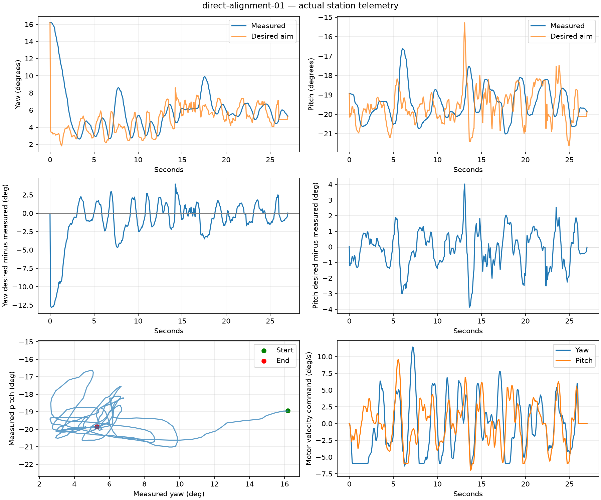

# Control-loop convergence review — 2026-09-06

**Status: partially verified. The live circling/overshoot is not resolved.**

**Follow-up:** [Camera, guidance and motor boundary review](motion_boundary_review_2026_09_06.md)
records later reproduced defects and the new tracking candidate's acceptance
status. The Manual/service state below describes the end of this earlier review.

This review concerns the unloaded camera/sensor station. The operator clarified
that the **turret's pointing direction** circles; detection is relatively stable
when the turret is held. Acceptance therefore needs measured yaw/pitch trajectories,
not an opinion about a stationary preview or a count of passing unit tests.

The experimental motion controllers below were rejected or remained inconclusive.
Normal service retains the previously accepted motor gains, speed limits and
trajectory path. The station is left in Manual/Hold. The new observer uncertainty
gate defaults off; the optional externally supplied planner velocity is used only
by the standalone comparison probe. Neither experimental path is enabled by the
normal launcher.

## Findings and boundaries

| Boundary | Evidence | Conclusion |
|---|---|---|
| Detector / lighting | Operator reports lower confidence with room lights on. Current camera configuration sets frame rate and orientation; it does not explicitly set exposure or gain. | Plausible contributor to missed detections, **not yet established by a paired lighting capture**. Do not lower thresholds or change motor gains on this evidence alone. |
| Detection / identity | In `noff-alignment-03`, selected track #30 becomes occluded/lost while confirmed person track #52 remains in the same image region. Their boxes overlap strongly, but their anchor heights differ by about 108 px. Selection stays on its original UUID. | Detection continues while the selected identity is lost. The overlapping tracks suggest a duplicate/association problem; the physical identity is not independently labelled. The loss-to-roam transition is separate from convergence. A new detection must not silently be treated as the old selected identity. |
| Confidence meanings | The same record reports detector scores about 0.56–0.62 while `selected_confidence` is about 0.98 and the motion band is HIGH. | Identity confidence and detector score are different signals. HIGH does not establish precise localization or a reliable velocity estimate. Localization uncertainty must be assessed separately. |
| Prediction / guidance | Raw camera-derived world goal and predicted goal move during the live trial; actual pointing overshoots those moving goals. | There is both changing input and amplification in the closed loop. No evidence supports blaming only the motors, only the detector, or only the Kalman filter. |
| Motor output | Actual motor velocity commands are now recorded separately from the position reference's derivative. A rough fit to the closed-loop trace suggests about 0.10–0.12 s motor response, with substantial residual error. | This is a diagnostic fit, not an independent plant identification or proof that motor dynamics are correct. Previous long-roam evidence remains the independent motion reference. |
| Web / selection IPC | Web converted UUIDs to hyphenated strings; the production tracker creates `uuid4().hex`. The service compared session strings literally and also converted requested track IDs into the wrong representation. | Verified integration defect. Normalize UUID identity at the boundary; keep stale-session rejection. Live web selection succeeds after the fix. |
| Field of regard / D-pad | Positive joint pitch tilts this camera down. The inset previously mapped positive pitch upward; the D-pad had the same physical sign error. | Fixed inset mapping and Pitch up/down commands. Pitch is a joint coordinate, not world elevation. |

## Actual yaw/pitch evidence

The direct velocity candidate ran for 27.0 s with one selected UUID and no reported
fault. It tracked for 90.7% of the sampled interval before losing selection visibility
and entering Auto Roam. The bounded capture stopped it into Manual/Hold.

| Tracking window | Yaw span | Pitch span | Yaw reference error, p95 | Pitch reference error, p95 |
|---|---:|---:|---:|---:|
| 5–15 s | 5.95° | 4.13° | 4.09° | 3.00° |
| 15–27 s | 5.44° | 2.91° | 3.10° | 2.08° |

These are not stationary-target accuracy specifications: the person/box is not
independent ground truth. They are sufficient to reject a claim that the visible
motion has settled. The recorded commands show repeated reversals.



Earlier, a damped position follower had a persistent roughly 1–2° orbit after
acquisition. A separate two-axis 5° offset return exceeded its 15° excursion guard
after 15.3 s. It was rejected despite passing the then-current late-settling
simulation check. Late settling alone missed its large initial overshoot.

Removing velocity feed-forward from direct tracking produced only 4.4 s and about
6.7 s captures before identity/visibility loss. Those runs cannot establish
settling or attribute the oscillation to feed-forward alone. That diagnostic also
caps tracking corrections at 6°/s and is not an acceptable replacement for the
previously accepted faster motion.

## Design comparison, not acceptance

`probe-closed-loop` exercises production camera geometry, timestamp history,
TrackingController, reference shaping and SpeedServo around an explicitly simulated
motor plant. Nine scenarios cover geometry mismatch, 12+6 px disturbances, slower
disturbances, delivery latency up to 160 ms, motor lag up to 150 ms, and 10/15°/s
target motion followed by a stop.

It does **not** reproduce real detector box changes, identity transitions, native
selection IPC, all mode/safety arbitration, or the actual motor plant. A simulated
pass is not physical acceptance. It is deliberately a standalone tool, not a
passing CTest item presented as evidence of live convergence.

| Candidate | Simulation observation | Physical outcome |
|---|---|---|
| Existing predicted goal → planner → velocity servo | Representative mismatch/noise stationary p95 43.6 px; motor-lag case 60.6 px. | Existing circling remains unresolved. |
| Damped position follower + credible target rate | Late p95 about 9 px, but initial overshoot about 4.6–5.4°. | Persistent orbit; diagonal-return excursion guard triggered. Rejected. |
| Direct predicted position + credible velocity feed-forward | Representative p95 16.6 px; initial overshoot 0.36°, 0.70° with motor lag. | Multi-degree repeated yaw/pitch reversals. Rejected. |
| Direct position feedback, feed-forward removed | Small-error simulation remains bounded; 6°/s correction ceiling cannot sustain a 10°/s target. | Detection/identity loss cuts both comparisons short. Inconclusive and not retained. |
| Larger direct position correction authority | Initial simulated overshoot about 8–11°. | Rejected before hardware execution. |
| Planned motion without differentiating predicted aim for target velocity | Representative initial overshoot 1.80°; 2.76° with motor lag; 10°/s moving error RMS 96 px. | Did not pass the simulation acceptance bounds; not deployed. |

Examples, from `Firmware/`:

```sh
build/probe-closed-loop config/turret.yaml baseline --verify
build/probe-closed-loop config/turret.yaml direct-trusted --verify
build/probe-closed-loop config/turret.yaml planned-trusted --verify
```

The baseline command is expected to fail the stated convergence criteria. The
direct candidate can pass those simulated criteria and still fail physically,
as the attached capture demonstrates.

## Retained changes

- Correct field-of-regard vertical direction and physical Pitch up/down mapping.
- Correct UUID representation across the web-to-native-selection boundary.
  Regression fixtures now use the production track/session representation;
  wrong sessions and expired requests are still rejected.
- Publish `tracking_command_rate_yaw_rad_s` and
  `tracking_command_rate_pitch_rad_s` after command clipping. During an active
  tracking velocity command, `tracking_velocity_control` is true. These are actual
  requested motor velocities; `q_ref_rate_*` continues to describe the trajectory.
  In the rejected direct-controller captures, `q_ref` was the desired aim itself
  and `q_ref_rate_valid` was false. Compare recordings with that distinction intact.
- Add the standalone controller comparison and capture-analysis tools, plus a
  full control-loop simulation regression covering convergence and explicit
  Manual/Hold ownership.

No motor gain, current limit, calibration, camera exposure, detector threshold or
normal startup-mode setting was changed by the accepted portion of this review.

Validation after restoring the motion path: **66/66 CTest groups passed** and
**40 Python tests passed** across native selection, field of regard and web drawers.
The no-argument launcher accepted valid retained calibration and skipped homing;
the restoration check then explicitly commanded Manual/Hold. The live web showed
the camera feed, tracking/prediction overlays in Auto Track, and the D-pad only
in Manual. None of these checks establishes tracking convergence.

## Remaining work, in measurement order

1. With motor position held, record detector input, exposure/gain metadata,
   confidence, raw anchors and identity changes under tagged lights-on/off
   conditions. Keep the person, framing and model fixed. The displayed ISP preview
   alone is not proof of what the network input looks like.
   The [Raspberry Pi AI Camera documentation](https://www.raspberrypi.com/documentation/accessories/ai-camera.html)
   describes separate network tensor and ISP output coordinate paths.
2. Obtain a camera-derived position reference that stays consistent as the camera
   moves, using a static scene feature as independent ground truth. Distinguish
   detector box/anchor bias from capture-time/pose alignment and geometry errors.
3. Identify motor response with fixed references and known trajectories; preserve
   the accepted long-roam behavior. Check stopping distance under acceleration and
   jerk limits before increasing correction authority.
4. Repeat a two-axis return and moving-target stop through the **full** production
   path. Require a contracting error envelope and no sustained orbit. Record raw
   localization, filtered/predicted direction, reference, commanded velocity and
   measured pose separately. Identity loss is a separate result, not a settling pass.

## Evidence files

Compressed JSON contains the original telemetry captures, not synthetic frames:

- `evidence/2026-09-06/direct-alignment-01.json.gz`
- `evidence/2026-09-06/noff-alignment-01.json.gz`
- `evidence/2026-09-06/noff-alignment-03.json.gz`
- `evidence/2026-09-06/closed-loop-stationary-selected-01.json.gz`
- `evidence/2026-09-06/closed-loop-diagonal-return-01.json.gz`

Reproduce the direct-capture figure with a project venv containing NumPy/matplotlib:

```sh
python tools/analyze_closed_loop_capture.py docs/evidence/2026-09-06/direct-alignment-01.json.gz
```

The command above must use the project venv's interpreter. No Python packages were
installed into system or user-global Python during this review.
