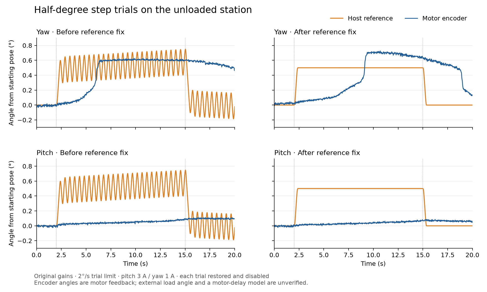

# Implementation takeover and station evidence — 2026-09-06

**Historical first-cycle report.** Current deployment, operating instructions and
validation are in [Automatic station validation](automatic_service_validation_2026_09_06.md).
Neither architecture plan is fully accepted. The operating-state descriptions below
record the earlier cycle and are superseded by that follow-up.

Scope: the perception/selection architecture v1 and CyberGear control hardening v3.2.
The user confirmed that the station was unloaded and safe to disable, and was present
for the motor trials. This is a camera/sensor pan-tilt system.

## Checkouts and operating state

- Review baseline: `68b8754`, initially clean tracked files.
- Local changes: `C:/workspace/OpenAutoTurret`, uncommitted.
- Isolated station checkout: `/home/eamars/workspace/OpenAutoTurret-takeover-20260906`.
- Original checkout: `/home/eamars/workspace/OpenAutoTurret`; original controller was
  stopped gracefully and parked. Its stale web process was subsequently stopped
  after it retained the camera devices despite reporting a failed camera open.
- New control code has been exercised with `controld --sim`. It has **not** been
  deployed as the physical controller. Physical motors are disabled.
- All completed hardware trials restored runtime parameters and verified disable.
  No persistent motor parameter writes, current-loop tuning, thermal changes, or
  expanded travel limits were performed.

## Findings and implemented repairs

| Boundary | Finding | Result and evidence |
|---|---|---|
| Selection authority | Python selection was disconnected from the live legacy controller selection path | Native atomic observation plus candidate-list packet, local UUID command service, actual selection ACK through web, and one Python selection authority |
| Identity | Legacy C++ selection could substitute a different UUID geometrically | Cross-UUID substitution removed; selection retains UUID through loss/retirement; no generation change on retries |
| UUID transport | Maximum UUID strings lost their last character | C++ text capacity corrected; full 128-bit identities round-trip through browser/API/IPC |
| Clear and ambiguity | Ambiguity retained motion authority; clear depended on stale frame inputs | Immediate hold on ambiguity; native clear resets acquisition/estimator through a new generation |
| Acquisition timing | New capture required measurement age exactly zero | Distinct accepted sensor timestamps counted; delayed 60 ms captures acquire in the actual simulated daemon |
| Stale input | Old live state exposed selectable candidates and unbounded prediction hours after vision stopped | Capture ordering and dimensions checked; expired candidates disabled; prediction bounded to 350 ms including lead |
| Estimator | Alpha-beta accepted extreme angular outliers | Constant-velocity Kalman estimator, covariance, detector/box-derived uncertainty, innovation gate, bounded adaptive process noise; explicit alpha-beta comparison profile remains |
| Sensor geometry | Generic letterbox math disagreed with camera SDK mapping | Live adapter uses `convert_inference_coords` with the same capture metadata and camera configuration as the official example |
| Camera ownership | Adapter reopened the network, and web could independently hold the sensor | Camera device reused; preview consumes an asynchronous JPEG tap; launcher owns only its own children |
| Recording and snapshots | Filesystem stalls delayed perception by seconds | Bounded background JSON snapshots and JSONL writers; dropped/incomplete recording evidence is explicit |
| Preview recovery | Web abandoned a stream permanently after a stale tap | Stale frames withheld; a fresh tap resumes an existing stream |
| CAN requests | Reply could arrive before waiter was armed; insufficient reply matching | Waiter armed before send; single-flight matching includes host, motor, register, communication type, and DLC |
| Command cache | Static caches crossed backend instances, failed writes could be cached, unknown current started at zero | Per-instance caches, retry after failed sends, limits before references, invalidation on disable/mode changes; unknown current never written by keepalive |
| Serial ownership | A second owner could disturb the adapter before opening failed | Exclusive device flock acquired before serial configuration or adapter commands |
| Serial backpressure | Blocking TTY writes could prevent a stop request from progressing | Nonblocking runtime serial I/O with a 2 ms send budget; real PTY saturation probe returned failure in 2.1 ms |
| Homing current | Both axes briefly entered speed mode at a hard-coded 5 A | Use each axis's configured initial current from the homing plan; a partial mode-entry failure disables both axes |
| Trial supervision | Blocking register reads or logging could suspend all trial checks | Independent 5 ms watchdog checks with 100 ms heartbeat/feedback limits, latched command inhibition, and repeated stop requests |
| HOLD destination | Encoder-following hold chased measurement noise | Fixed latched destination retained; full quiet-hold profile remains a commissioning item |
| Reference braking | Small fixed requests oscillated because the braking integral continued past zero velocity and subtracted reverse travel | Integrate only to the first zero of velocity; bench reference oscillation fell from about 0.43 degrees peak-to-peak to zero after settling |
| Startup | Launcher killed unrelated processes and automatically entered roam | Supervised children, single-owner lock, perception-only default; explicit simulated or hardware stack; modes remain operator-driven |

Native packet: `OTP1`, version 1, 100-byte header plus 2,562-byte candidate list,
2,662 bytes total. Session, selected UUID, selection generation, track-set sequence,
state, validity, anchor, and quality travel together. Legacy compatibility is explicit
(`--legacy-track-wire`), and native authority cannot silently downgrade.

Optional AUTO_SELECT_SINGLE uses expiring, session-matched controller context.
Missing, stale, or non-AUTO_TRACK context denies automatic selection. Explicit
selection is the default. `--select-uuid` is replay-only; live selection uses the API.

## Measured camera/geometry evidence

Evidence below is on the Pi under `run/hardening/` or `run/models/` in the isolated checkout.

- Native web/IPC/controller probe selected Person 2, retained the exact UUID and
  generation through loss and reconnection, then cleared. Fresh browser console
  reported no errors. These candidates and motor feedback were synthetic fixtures.
- A 60 ms delayed fixture reached `TRACKING` in the actual C++ simulated daemon.
  `native-tracking-probe.json` and `native-loss-probe.json` preserve states.
- SSD live camera run `native-process-1788621817067653586`: 1,207 native publications,
  zero inference failures, zero camera stalls, maximum receive gap 53.197 ms.
  Last 512 processed frames: sensor-to-publication p99 58.619 ms, max 60.952 ms;
  frame processing p99 2.839 ms. Preview produced 403 JPEGs without errors.
- Diagnostic snapshot writer deliberately replaced 116 pending snapshots under
  storage pressure; 1,091 snapshots were written. These are latest-state diagnostics,
  not a complete recording. JSONL recording has independent queue/drop accounting.
- Final SSD run with SDK coordinate mapping (`native-process-1788625132815337051`):
  1,012 observations published, no inference/publish failures or camera stalls;
  maximum camera receive gap 57.71 ms. Last 512 frames: sensor-to-publication
  p99 67.618 ms, max 70.358 ms. All 1,012 detection/camera/observation records
  drained to disk with zero drops; 338 JPEGs published without errors.
- Final Kalman/native process probe (`native-kalman-final.json`): selected UUID
  `0:18`, generation 1, reached TRACKING; loss and socket reconnection preserved
  both. Clear advanced generation to 2, entered WAIT_TARGET, and invalidated
  prediction. Optional automatic selection was denied in MANUAL and for a wrong
  session, allowed only with fresh matching AUTO_TRACK context. Motors and people
  in this probe were simulated fixtures.
- Before async recording, runs showed 1.96–3.71 second stalls. Passing average FPS
  alone had hidden this failure.
- `coordinate-baseline.json`: normalized input yxyx `(0.2,0.1,0.7,0.8)` mapped by
  SDK to pixel xywh `(191,108,1343,719)`. Old adapter produced top `-0.03333` and
  bottom `0.85556`, while the correct normalized values are `0.1` and `0.76574`.
  `coordinate-fixed.json` confirms the repaired adapter uses the SDK result.
- The preview was almost completely dark. The independent reference capture
  measured pixel mean about 1.65/255 and p99 10/255 at 33 ms exposure and gain 16.
  No lit real-person selection/crossing/occlusion acceptance is claimed.

Timing percentiles are rolling windows, not whole-run maxima unless explicitly
stated. Camera receive FPS and new inference FPS are different measurements.

## YOLO11n reference model

The official model was downloaded into project-local `run/models`:

- Source: [Raspberry Pi model zoo](https://github.com/raspberrypi/imx500-models/blob/ddfe4c7ec96c0289e5f2d5996894311a218b2e1c/imx500_network_yolo11n_pp.rpk)
- SHA256: `c8e53dd9208debff3cd72044600095624952d6fb4e67910e2e8098251e0307fa`
- Size: 3,268,840 bytes; upstream license: AGPL-3.0.
- Reproduce download: `../run/station-venv/bin/python tools/fetch_yolo11n.py` from Firmware.
- Reference parser: [Raspberry Pi example, pinned revision](https://github.com/raspberrypi/picamera2-examples/blob/28c016d1ddabbacc6098cbaa93ec4cfdfb1532f8/examples/imx500/imx500_object_detection_demo.py).

This artifact contains no network_intrinsics. The reference example supports that
case using external task/label/box declarations. Our external contract is explicit
and accepted only for the exact reviewed hash; arbitrary missing metadata still fails.

Measured output tensors are `(300,4), (300,), (300,), (1,)`; boxes are **input pixels**
in xyxy order. The old manifest incorrectly claimed fractions. The reference
`--bbox-normalization` flag means *divide pixels*, whereas our manifest's
`bbox_normalized` describes the incoming units.

At requested camera 16 fps, the reference run delivered 482 frames / 241 tensor
frames in 30 seconds. Adapter run delivered 400 frames / 200 new inferences and zero
model failures. Missing NN metadata is counted separately and never republished with
a newer timestamp. Person class 0 is supported; labeled quality, non-person label
mapping, and throughput optimization remain unverified. SSD remains the available
baseline. YOLO thresholds remain COMMISSION, and production validation refuses them.

## Unloaded CyberGear commissioning

Transport: Yousee USB-CAN `/dev/ttyUSB0`, UART 921600, CAN 1 Mbit/s, host 0,
pitch ID 100, yaw ID 101. Runtime gains both axes: loc_kp 30, spd_kp 1,
spd_ki approximately 0.002. Current limits: pitch 3 A, yaw 1 A. Current-loop gains,
12 Nm torque limit, and protection settings were unchanged. Firmware revision and
persistent/debugger registers remain unverified: optional reads echoed unrelated
runtime values and are preserved as raw bytes, not interpreted as firmware facts.

Trials were one axis at a time in the central safe travel region, at at most
2 deg/s and at most 2 degrees excursion. Values below discard the first second.

| Trial | Yaw position RMS (deg) | Pitch position RMS (deg) | Yaw Iq RMS (A) | Pitch Iq RMS (A) |
|---|---:|---:|---:|---:|
| Disabled | 0.00442 | 0.00495 | 0 | 0 |
| Fixed reference, stock gains | 0.00887 | 0.00786 | 0.0928 | 0.0822 |
| Old encoder-chasing hold | 0.01474 | 0.00781 | 0.1432 | 0.0806 |
| Current mode, 0 A reference | 0.12973 | 0.00791 | 0.1368 | 0.0737 |
| Speed Ki reduced to 0 | 0.01468 | 0.00771 | 0.1371 | 0.0767 |
| Position Kp reduced to 10 | 0.01414 | 0.00747 | 0.1388 | 0.0813 |

The user heard humming stop and return with the enabled-drive trials. This supports
an enabled-drive association; it does not establish PWM, backlash, or integral
hunting as the cause. Neither gain reduction justified changing the stock profile.

Lower-current yaw trial at 0.3 A aborted at the current threshold and restored.
The corresponding pitch trial completed. An interrupted Ki trial exercised restore,
and an independent read verified Ki returned to 0.002. The first fixed-reference
setup failed because disabled firmware pins LocRef to encoder position; neutral
disabled readback now has a measured 0.001 rad tolerance. Normal parameter checks
retain strict tolerance.

Small-signal position/speed sine trials completed without faults and restored.
Responses were too weak to fit a credible actuator delay or promote speed-mode
AUTO_TRACK. Requested sine amplitude was 0.5 degrees at 0.3 Hz; the production
reference limiter affected the actual excitation, so use logged references, not
the requested sine, in any fit. Diagnostic sampling was about 45 Hz; roughly
136 Hz command requests are **not** the control-loop rate or actual CAN writes.

The final watchdog harness repeated five-second stock fixed holds, one axis at a
time (`watchdog-fixed-{yaw,pitch}-01`). Both recorded 228 samples, completed with
no watchdog trips/stop failures, restored all parameters, and verified disabled
feedback. After discarding the first second, yaw/pitch position RMS was
0.01066/0.00960 deg, with Iq RMS 0.14095/0.08215 A. This does not demonstrate a
quiet-profile improvement.

Fault injection uses the production CAN request waiter with replies withheld:
a 250 ms read continued waiting while the independent watchdog stopped the
simulated drive at about 101 ms. Subsequent enable was denied. Feedback loss and
the absolute trial deadline also stopped it. This is an in-process host watchdog;
drive-side communication timeout and recovery from a physically broken CAN/USB
link are not verified by these tests.

### Step-response finding and repair

Twenty-second, half-degree position steps exposed a separate host-side defect.
At the 2 deg/s trial limit, the old reference generator's braking calculation
returned essentially zero stopping distance. Integrating beyond zero velocity
subtracted imaginary reverse travel. The fixed calculation gives 0.15396 degrees;
the small-step probe settles under both regular 5 ms and irregular 5/22 ms timing.

Before/after physical runs used the same stock gains and limits, one axis at a
time. Between seconds 4 and 15, host reference peak-to-peak variation changed from
0.42896 to 0 degrees on yaw, and 0.42695 to 0 degrees on pitch. All four runs
restored, verified disabled, and recorded no watchdog trips.



The corrected reference reveals substantial remaining motor behavior: yaw had a
delayed rise and overshoot; pitch achieved only about 0.057 degrees near the end
of the commanded 0.5-degree plateau. This is not a credible basis for a single
linear actuator delay or a promoted speed-controller profile. Encoder traces
are not external load-angle measurements. Raw runs are `position-step-{yaw,pitch}-{01,02}`;
the figure and numerical summary are in `docs/evidence/2026-09-06/`.

Final independent snapshot (`snapshot-takeover-final/before.yaml`) confirmed both
motors disabled, no fault bits, original gains (30 / 1 / 0.002), pitch 3 A and yaw
1 A current limits, and 2 deg/s runtime speed limits. Temperature was 22.6 C
pitch / 25.9 C yaw. The production controller remains stopped.

## Remaining acceptance and implementation gates

| Area | Remaining work |
|---|---|
| Quiet HOLD | Commission per-axis meaningful arrival speed limit and hysteresis; current arrival speed cap remains zero. Verify audible improvement, disturbance recovery, sag, and 5–10 minute temperature rise. |
| Mode transition | Replace blocking recipes with a stopped, nonblocking, verified transition state machine; protect feedback/STOP handling throughout and verify bumpless enable. Current recipes remain blocking. |
| Trial watchdog | Host watchdog and bounded serial TX are implemented and probed, including normal unloaded hardware trials. Drive-side communication-loss behavior and physical CAN/USB fault recovery remain unverified. |
| Estimator | Fit noise/covariance priors and validate innovation thresholds on labeled motion/reversal recordings. Current priors and 40 ms actuator lead are provisional. Kalman/math tests are not motor prediction A/B evidence. |
| Dynamic motor response | Obtain identifiable position/speed response and reversal traces before choosing speed control or fitting delay. Implement and A/B host P plus velocity feed-forward under the existing v/a/j and stopping envelope. |
| Real vision | Lit single-person, two-person crossing, occlusion, edge entry/exit, and camera-pan recordings with ground truth; determine thresholds and evaluate model scorecard. |
| Payload | Only unloaded trials exist. Any fitted payload requires separate qualification. |
| Native protocol | Extend full diagnostic provenance as needed (anchor source and full covariance contract); the live packet already carries the authority/identity/validity needed for control. |

The large plans are not complete just because regression suites pass. No physical
tracking deployment is justified by the simulated controller and dark-scene camera
runs recorded here. Preserve the measured limits and original gains for the next
commissioning step.

## Reproduction

Use project venvs only. The isolated `.venv` shares the original test environment;
`run/station-venv` was created with system-site-packages for distro Picamera2/libcamera.

```sh
cd /home/eamars/workspace/OpenAutoTurret-takeover-20260906/Firmware
cmake --build build -j2
ctest --test-dir build --output-on-failure
../.venv/bin/python -m pytest -q perception/tests vision/tests web/webd/tests
build/probe-register-boundary
build/probe-command-cache
build/probe-estimator-boundary
build/probe-commissioning-watchdog config/turret.yaml
build/probe-yousee-backpressure
build/probe-reference-settling
PYTHONPATH=. ../run/station-venv/bin/python tools/probe_native_selection.py --duration-s 240
PYTHONPATH=. ../run/station-venv/bin/python tools/probe_native_selection.py --camera --duration-s 50
```

Probe controller output is always simulated. `run_application.sh` defaults to
perception only. `--sim` supervises the full software stack with simulated motors;
`--hardware` explicitly permits real boot homing. Ctrl-C stops only that stack's
children; the hardware controller performs its own park/disable sequence.

The launcher's finite offline replay was also run with `--sim --no-web --frames 60`:
it exited successfully, stopped only its child controller, and logged clean
de-energization. Simulated homing takes about 140 seconds before mode commands are
admitted; do not interpret an early "homing in progress" rejection as selection
failure.

Final regression evidence: **63/63 C++ test targets** and **776 active Python tests**
(14 subtests) passed. The Python run reported one dependency deprecation warning.
`git diff --check` passed. Logs are `ctest-reference-final.log`, `pytest-final.log`, and the
named runtime probe files under `run/hardening`. A local evidence copy is under
the ignored `run/takeover-evidence/` directory.

Repository-wide unqualified pytest discovery also collects the retired
`legacy/opencv_test.py`, which needs unavailable ultralytics. The active suite
command above excludes that obsolete demonstration script.
