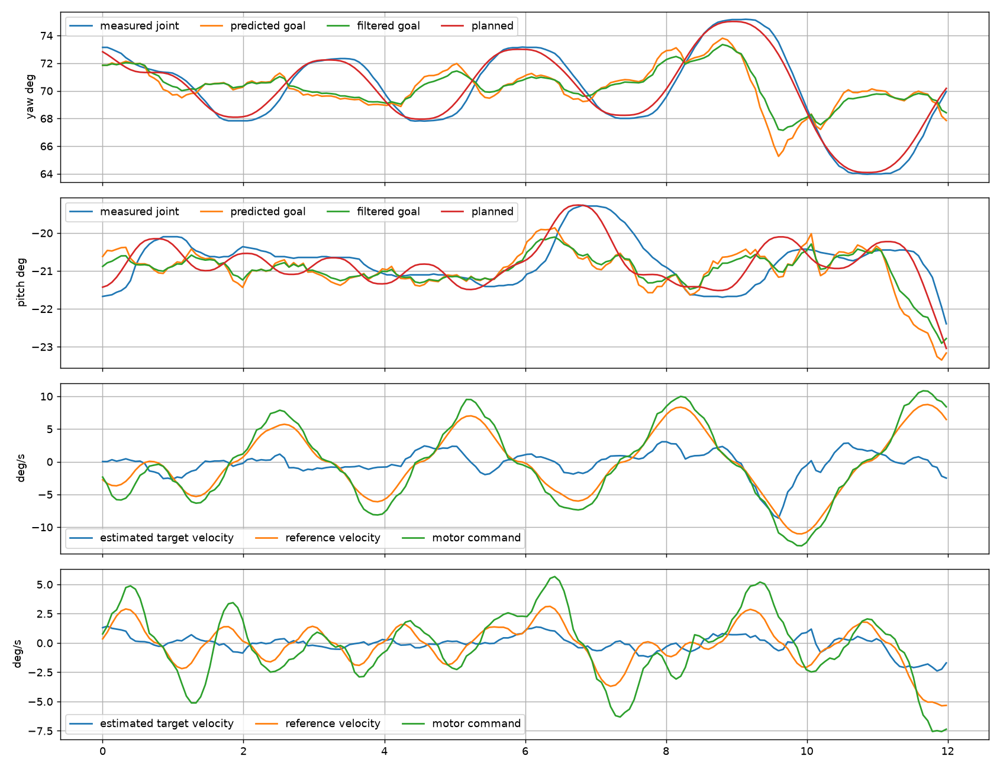
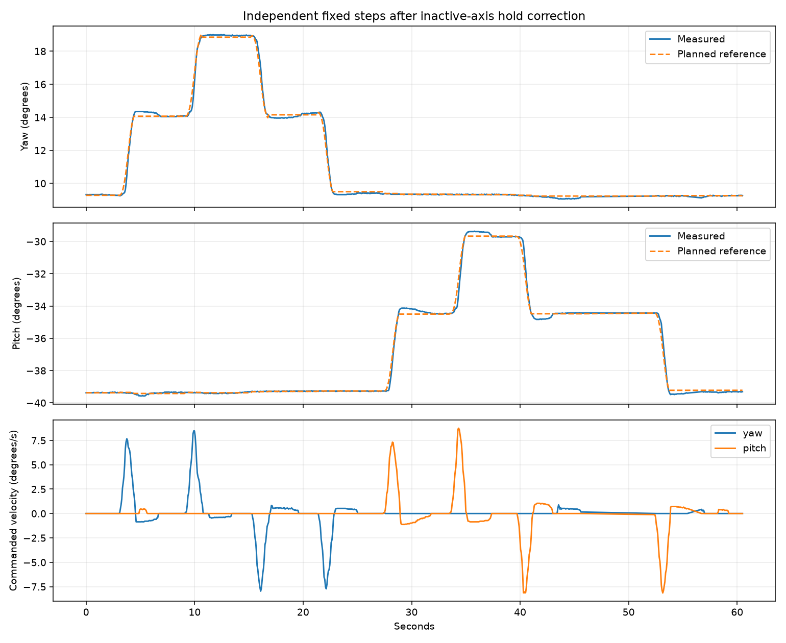
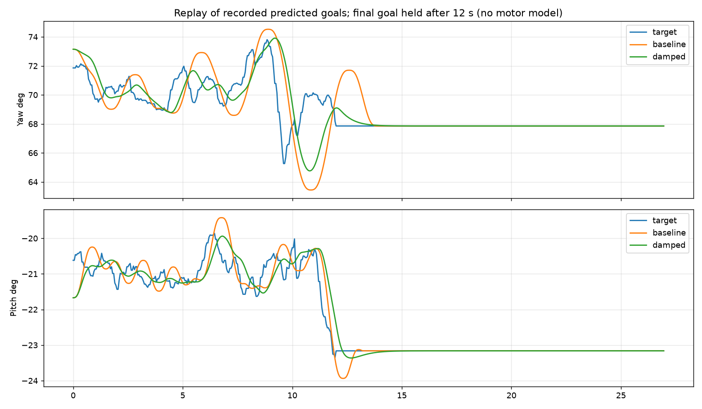

# Camera, guidance and motor boundary review — 2026-09-06

Historical unloaded trial. For current operations see [the station runbook](STATION_OPERATIONS.md);
for subsequent loaded validation see [the travel review](travel_boundary_review_2026_09_06.md).

**Status: partially verified.** Camera-coordinate and Manual-axis defects were
reproduced and corrected. A new tracking reference generator passes offline
closed-loop probes and is running on the unloaded station. Post-change live
captures so far contain no confirmed person. They **do not establish that
person-tracking circling or overshoot is resolved**.

This continues [the earlier control review](control_loop_review_2026_09_06.md).
The operator asked to stop acoustic tuning and separate detection, estimation,
guidance and motor response. Motor gains, current limits, calibrated travel and
the accepted speed limits were preserved during this review.

## Measured boundaries

| Boundary | Evidence and result |
|---|---|
| Camera pixels and capture identity | Each preview JPEG now embeds its own sensor timestamp, frame sequence, camera settings and detection/track metadata. Capture-to-metadata receipt median 39.06 ms, p95 40.90 ms. One atomic publication avoids pairing old pixels with a newer sidecar. Encoding stays outside the camera thread. |
| Network input versus preview | A bounded probe captured the actual 320×320 network input and 1920×1080 ISP image from the same sensor frame. The network image is upright and sees the taller sensor field; the preview is cropped to 16:9. This empty-room capture cannot settle the lighting/confidence question. |
| Detection anchor versus crop | The installed SDK clips a rectangle to the ISP crop. Computing the torso fraction afterward displaced a synthetic translated anchor by +99 to −81 px. Compute the anchor in the original model box, then map the point through the SDK. The actual SDK probe leaves less than 2 px integer-rectangle error. This is mapping accuracy, not human localization accuracy. |
| Invalid anchor versus identity | An original anchor can be outside the preview while part of its box remains visible. Keep that box for association/display, but publish an invalid motion measurement with zero quality. Identity confidence cannot validate an unavailable anatomical point. |
| Encoder feedback versus history | Repeated feedback had been stamped at each 200 Hz tick. Append each axis's actual receive timestamp once; interpolate capture-time pose from those samples. This does not claim exact motor sampling/exposure clock calibration. |
| Manual inactive axis | During a pitch step blocked by the braking margin, yaw drifted about 2° in four seconds. Its target was re-seeded from measured position, then differentiated by the planner. Latch both destinations on step/jog entry and reject endpoints with no braking authority. Repeat inactive-axis spans were 0.044–0.240°; endpoint overshoot was at most 0.136°. |
| Feedback availability | One watchdog event had host heartbeat age 2.133 ms and pitch feedback age 0.979 ms, but yaw age 100.031 ms. Keep the 100 ms watchdog; increase unchanged-command solicitation from a 50 ms interval to 20 ms. Repeat feedback ages were p50 6 ms, p95 17 ms, max 18 ms, with no fault or serial-resynchronization growth. No raw trace proves the original transport-loss mechanism. |
| Guidance versus motors | In the first 12 s of `automatic-boundary-02`, yaw reference speed p95 was 8.68°/s versus estimated target speed 3.11°/s. Actual pose followed the reference within about 0.79° p95 on both axes. The reference itself oscillates and amplifies the changing goal. Those input signals are not independent stationary-target ground truth. |

The watchdog event de-energized the drives. Recovery used the normal launcher
and completed full homing. Later stationary application restarts validated
retained calibration before skipping homing. No invalidation rule or braking
margin was bypassed. The repeated Manual steps had final endpoint error at most
0.323°; the smaller overshoot number is not absolute positioning accuracy.





## Tracking reference design

The waypoint planner remains in Roam and Manual. It had treated each noisy
tracking goal as another destination to reach on a maximum-braking-speed curve,
and differentiated the position corrections into a second target velocity.

Speed-mode tracking now uses `control/tracking_reference.hpp`:

```
image anchor + capture-time encoder pose
  -> world angular position/rate estimator and covariance
  -> uncertainty-gated prediction and explicit joint velocity
  -> damped tracking reference (position, velocity, acceleration)
  -> existing SpeedServo -> envelope/watchdog -> CyberGear speed mode
```

Unsaturated reference acceleration is
`ω²(target − reference) + 2ω(target_velocity − reference_velocity)`, where
`ω = 2.5 s⁻¹`. Existing service planning limits remain 15°/s² and 60°/s³.
Velocity headroom reserves room to release acceleration before reaching the
speed limit. Two standard deviations of rate uncertainty are subtracted before
using the estimated rate for prediction/feed-forward; raw estimator rates remain
separately observable. Safety, homing, stale observations and mode ownership
retain priority. Motor gains and the existing SpeedServo are unchanged.

Telemetry distinguishes `tracking_aim_*` (resolved predicted goal),
`guidance_target_rate_*` (rate used by guidance), `q_ref_*` and its derivatives
(trajectory), `service_command_rate_*` (actual requested motor velocity), measured
`q_*`, and per-axis `feedback_timestamp_*`. `tracking_reference_damped` identifies
the active path. The inset's amber **PRED** marker now shows the resolved aim and
disappears when prediction is inactive. It previously displayed the intermediate
reference under that label, even during roaming. The camera prediction overlay
continues to use the controller's actual LOS intent.

## Design probes and limitations

`replay-guidance` applies identical recorded goals to both production reference
generators, without a camera, estimator update or motor model. In the recorded
12-second input, the damped reference reduced yaw travel from 40.86° to 29.56°
and pitch travel from 15.32° to 8.66°. Both settle when the final input is held.
This isolates shaping; it is not a new physical trial.



`probe-closed-loop` adds production geometry, history, estimator, solver and
SpeedServo around an explicit simulated plant. `damped-trusted` passes the nine
stated criteria:

| Scenario | Late stationary error p95 | Initial overshoot |
|---|---:|---:|
| Nominal stationary | 0.19 px | 0° |
| Geometry mismatch and image disturbance | 4.57 px | 0.28° |
| 160 ms delivery delay | 4.54 px | 0.33° |
| 150 ms motor response | 4.70 px | 0.81° |
| Slower image disturbance | 13.19 px | 0.37° |

The 10°/s moving case had 47.73 px horizontal RMS error during its measured moving
interval. The 15°/s case still had about 320 px RMS: it reaches the planning
ceiling with little catch-up authority. Passing that case's stationary criterion
does **not** establish accurate 15°/s pursuit. No physical tracking-speed
specification is established. With ungated target velocity, the damped reference
fails the slow-disturbance criterion (32.98 px p95): explicit velocity alone is
insufficient. Earlier rejected candidates remain documented in the preceding review.

## Runtime validation

- Eight Manual-axis steps completed without a fault.
- The 90-second, 240-second and final 300-second post-change automatic recordings
  completed without a fault, but selected no person. The final capture had 4,045
  unique telemetry samples, camera rate at least 26.0093 fps and maximum feedback
  age 11 ms. They establish roaming availability, not tracking convergence.
- Browser checks exercised Manual/Hold and Auto. The live feed rendered; the
  D-pad appeared only in Manual; Auto was restored from the web.
- 66/66 CTest groups passed, including simulated full-loop convergence and Manual
  ownership. 54 focused Python checks passed after preview, probe cleanup and web
  changes. Earlier anchor integration passed 399 perception tests plus 14 subtests.
- The four-minute API recording has an 8.47-second sampling gap. Its receive
  timestamps show a recorder gap, not repeated stale telemetry. Analysis marks
  gaps instead of drawing an invented continuous trajectory.
- The running controller executable matched the built executable's SHA-256;
  15 key source/configuration files matched between the local and station repos.
  The final web command selected Auto; the station remains in automatic service.

Normal no-argument service remains:

```sh
bash Firmware/scripts/run_application.sh
bash Firmware/scripts/run_application.sh status
bash Firmware/scripts/run_application.sh stop
```

Manual/Hold, return to Auto, D-pad movement and homing are web commands. Startup
homes after de-energization; it skips only when retained calibration and the
continuously energized motor state validate.

## Reproduction and evidence

From `Firmware/`, after the CMake build:

```sh
build/probe-closed-loop config/turret.yaml damped-trusted --verify
build/probe-closed-loop config/turret.yaml damped --verify
build/replay-guidance docs/evidence/2026-09-06/recorded-goal-12.csv
```

The ungated `damped` command is expected to fail one criterion. The installed-SDK
anchor probe owns no camera and issues no motor commands. From the Pi repo root:

```sh
PYTHONPATH=Firmware run/station-venv/bin/python Firmware/tools/probe_sdk_anchor_crop.py
```

`capture_motion_boundary.py OUTPUT --observe --seconds 90` records without
changing modes. `--sweep` and `--automatic` issue bounded motion commands and
stop into Manual afterward. All Python commands require a project-local venv.

Compressed telemetry and figures are under `docs/evidence/2026-09-06/`. Original
frame/metadata captures, including the paired network/ISP diagnostic, remain in
the station's ignored `run/` directory. No synthetic frame was substituted into
the production detector or represented as physical tracking validation.

## Outstanding physical acceptance

1. With this exact candidate, record a visible stationary person and require a
   contracting yaw/pitch error envelope rather than repeated orbiting.
2. Record sideways movement and a stop. Compare prediction, desired goal,
   trajectory and measured pose separately. Identity loss is a separate result.
3. Capture tagged lights-on/off pairs with the same person, framing and model.
   A controlled pair has not justified any detector threshold or exposure change.
4. Retain the candidate only if physical tracking supports it.

Camera sources: [AI Camera documentation](https://www.raspberrypi.com/documentation/accessories/ai-camera.html),
[Picamera2 IMX500 adapter](https://github.com/raspberrypi/picamera2/blob/main/picamera2/devices/imx500/imx500.py),
[Picamera2 manual](https://datasheets.raspberrypi.com/camera/picamera2-manual.pdf).
No guessed half-exposure offset or new focal-length fit was applied: moving-scene
fits were affected by depth/parallax and inconsistent across runs.
