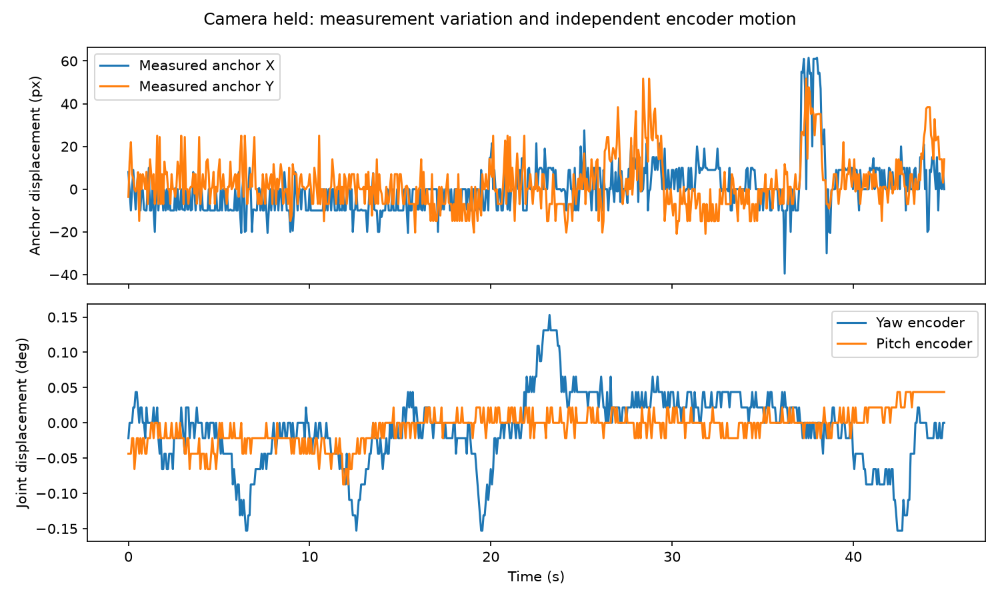
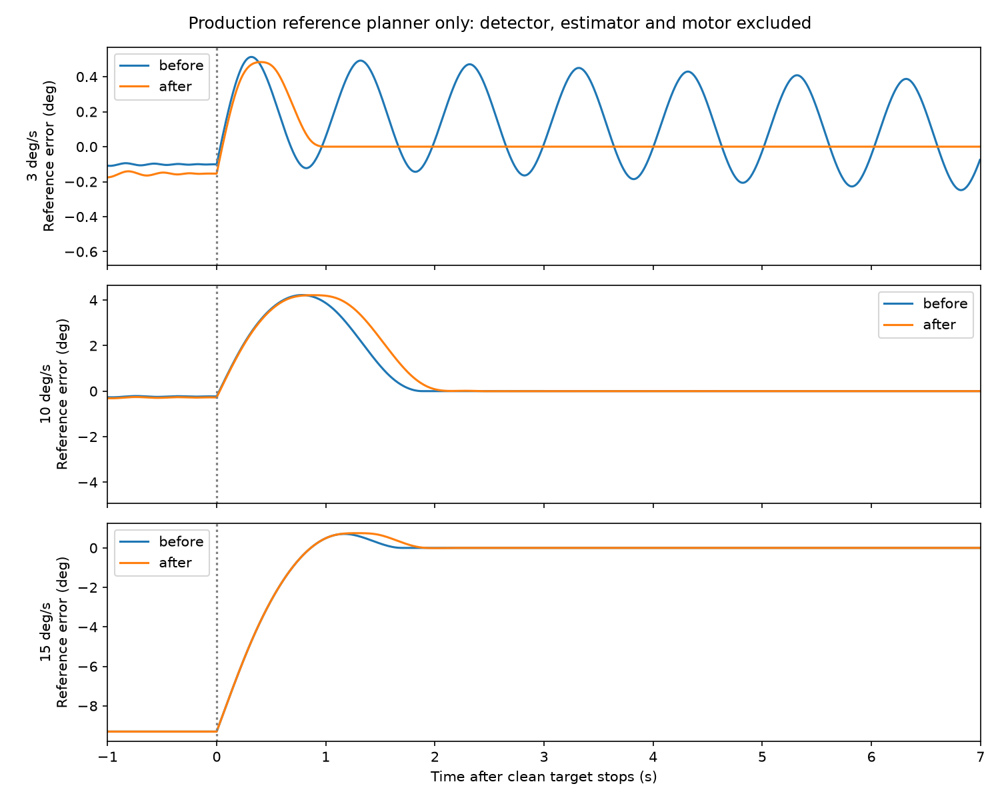
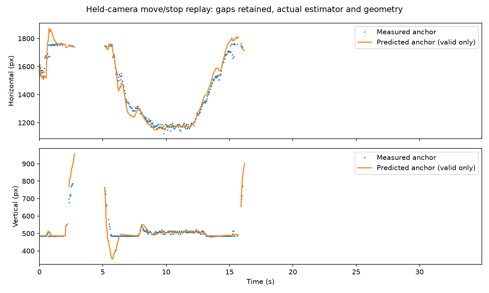

# Tracking instability: isolated measurements, 2026-09-06

Later live trials still showed circling. See the
[control-loop review and rejected candidates](control_loop_review_2026_09_06.md).
The isolated planner correction below is not a claim of full-loop convergence.

Status: **partially verified**. One software oscillation is reproduced, corrected
and deployed. Detector anchor variation and camera-motion compensation error are
separately measured; neither is claimed resolved. The operator accepted the faster
motor response as much smoother before this investigation, then reported excessive
tracking overshoot. Motor gains, speed limits, acceleration limits and prediction
lead were held fixed throughout this isolation cycle.

The unloaded station was in Manual/Hold during the camera-only measurements.
The operator completed the requested stationary and sideways move/stop/reverse
sequences. Further movement is not required to reproduce the recorded analyses.

## Findings at independent boundaries

| Boundary | Experiment | Evidence | Conclusion |
|---|---|---|---|
| Detection/identity | 45 s held camera, stationary-subject instruction | Same confirmed selected UUID in all 681 unique telemetry states; six other tentative identities never became the selected track | Selected-identity switching does not explain this recording's anchor movement. Full detector accuracy still needs labeled images. |
| Measured anchor | Same held-camera recording | X/Y standard deviations 12.16/11.96 px; spans 101.00/72.65 px. Encoder standard deviations only 0.051/0.023 degrees | Upstream anchor variation exists without tracking motion. This is not proof that every pixel of variation is detector noise: posture, partial visibility and bounding-box changes also matter. |
| Camera-motion compensation | Six stopped 5-degree yaw/pitch steps, tracking disabled; static-background features exclude detected people | Four yaw moves leave 16.76–18.99 px median residual on 129–151 px observed image motion. Horizontal residual changes sign with yaw direction | The current rotational camera model does not fully explain actual scene motion. This can create false target motion in the world-frame estimator. It is independent of target association and servo following error. |
| LOS estimator/prediction | Replay timestamped native measurements through production geometry, covariance and C++ estimator; camera held | 329 valid observations, 324 accepted, 5 rejected. Invalid observations remain gaps | The estimator can be examined without moving motors. Predicted-vs-current-anchor displacement is not an accuracy measurement against the future target. |
| Reference planner | Clean target moves at 3 degrees/s for 4 s, then stops; production limiter, no detector/estimator/motor | Before: 14 crossings beyond a 0.05-degree band and continuing oscillation. After: one crossing, then exact settlement | A software limit cycle is proven and corrected independently of camera noise. |
| Motor following | Earlier uninterrupted 10 degrees/s roam with target acquisition suppressed; subsequent manual jog/stop checks after this fix | Earlier straight-rate RMS error 0.553 degrees/s; latest four jog directions/stop checks all ALLOW, no fault | Retain the accepted motor response. Current target overshoot must not all be attributed to the drive. |

The telemetry anchor is the published **measured** anchor, after detector
normalization/association, not a recording of all raw detector candidates. The
current SSD profile uses `bbox_torso`: horizontal box center and 45% of box height.
A clipped or changing body box therefore changes the physical point represented
by the anchor. The capture contains such box changes near image edges, but lacks
labeled image truth needed to classify every jump. Perception deliberately
publishes measurements without smoothing; the controller owns temporal estimation.



## Geometry: reject a fit that does not transfer

The previously stored boresight correction was fitted near pitch -0.697 rad.
The new independent trial used pitch approximately -0.27 and -0.19 rad, after
settling at each pose. Directional residuals persisted across both yaw directions.
Pitch moves left median residuals of 10.94 and 7.22 px.

An offline fit of focal lengths and pitch offset to the older six moves estimated
fx/fy 1519/1481 px and offset -0.916 rad. It reduced the new yaw residuals to about
5–8 px, but left one new pitch residual at 10.25 px. Fitting the new set alone
instead estimated 1621/1567 px and -0.891 rad, and worsened several older moves.
These inconsistent fits are evidence against declaring a new calibration complete.
**No new fit from this cycle was deployed.** Intrinsic scale, mount geometry,
distortion and translation/parallax are not yet separated. A multi-pose calibration
with independent holdout scenes, including different feature depths, is required.

Association also currently uses `camera_motion.provider=none`. Its image-space
velocity includes camera movement. The existing external-pose provider assumes a
single focal length and uniform yaw/pitch image shift; simply enabling it would
not validate this station's full transform. The image-GMC provider is explicitly
unimplemented. This is a remaining architectural integration gap, not a motor-gain
problem.

## Planner correction and its limits

The previous braking reserve accounted for travel to the first zero of velocity,
but not for releasing acceleration to zero. Braking acceleration could therefore
remain active at rest and start another reversal. The correction reserves the
complete jerk-limited stopping trajectory and releases braking acceleration while
enough velocity remains to bring acceleration to zero. The existing first-zero
distance helper keeps its original contract.

| Clean target speed before stop | Initial overshoot before / after | Repeated crossings before / after | Final error after |
|---|---:|---:|---:|
| 3 degrees/s | 0.513 / 0.484 degrees | 14 / 1 | 0 |
| 10 degrees/s | 4.221 / 4.215 degrees | 1 / 1 | 0 |
| 15 degrees/s | 0.708 / 0.747 degrees | 1 / 1 | 0 |

The 15-degree/s case was still behind its target at the instant of stopping;
its smaller overshoot does not mean a higher speed is easier to stop. At 10
degrees/s, even an instantaneous change to the permitted 15 degrees/s² braking
acceleration requires 3.33 degrees of travel; the jerk limit adds more. The fix
removes repeated software oscillation, not unavoidable initial stopping travel.



The first candidate removed the limit cycle but failed an existing static-step
overshoot test. It was not activated on hardware. The complete stopping reserve
and acceleration-release correction passed all 11 limiter tests and all **66
CTest targets** before activation. A regression now checks the clean moving-target
stop settles in both position and speed under the actual service limits.

## Keep the signal boundaries inspectable

The diagnostic path separates the following quantities rather than optimizing a
single screen-error number:

1. Detector/association: capture timestamp, selected UUID, validity, raw measured
   anchor, bounding box, anchor source and confidence. Labeled capture is needed
   to distinguish true subject motion from measurement error.
2. Geometry: measured anchor plus encoder pose **at capture time** becomes world
   LOS. Static-scene camera movement tests this boundary without a moving target.
3. Estimation: accepted raw LOS, innovation, rejection, filtered LOS and angular
   rate. A recorded input can be replayed without motor feedback.
4. Prediction: filtered state projected to the intended actuation timestamp.
   Compare against future truth, not the current detection. The existing 120 ms
   motor response plus 20 ms control lead remains unchanged in this cycle.
5. Planning: desired joint direction becomes bounded position/rate/acceleration.
   Clean synthetic targets expose planner overshoot without perception or motors.
6. Servo: planned reference versus encoder trajectory. Long target-free moves
   measure motor following; they do not validate detection or prediction.

Physical camera feedback is unavoidable. These boundaries make its contribution
measurable rather than compensating for geometry or detection errors through
motor gains. The accepted earlier change gave the servo recovery authority above
the planned speed; it did not increase the planner's acceleration or jerk limits.

The held-camera replay uses native capture/publication timestamps and interpolates
the lower-rate API encoder samples. It is a component replay, not an exact replay
of the controller's 200 Hz pose history. Of 921 native captured frames, 334 were
valid confirmed observations; the subject left the fixed camera's field of view,
so the remaining stale/lost/occluded frames are not a detector failure rate.
The prepared in-range replay has 909 rows and 329 valid measurements. Predictions
are plotted only while the production estimator reports them valid.



## Live verification and current service

The rebuilt controller was activated from verified stationary Manual/Hold with
the unchanged normal configuration. Its owned process was restarted in the
already-authorized retained-calibration commissioning procedure. The normal
no-argument launcher reported retained calibration validated and skipped homing.
This is distinct from normal script stop, which parks/disables and invalidates
calibration as documented in the service report.

Four two-second FINE jogs (yaw +/-, pitch +/-), each followed by a four-second
stop observation, completed without faults and with ALLOW throughout. Maximum
reference error during each last approximately one-second observation was under
0.132 degrees. The browser showed the Manual direction pad, then the actual Auto
button restored autonomy and hid it. An ensuing 45-second recording stayed in
Auto Track for all 681 unique telemetry states, with one selected UUID and no
faults. This is integration evidence, not complete tracking-overshoot acceptance.
The live browser showed the real feed, detection box and amber controller cue.
The station was left in **Auto**.

## Reproduction and evidence

From the repository root, using a project-local Python environment with NumPy:

```sh
python Firmware/tools/prepare_tracking_replay.py \
  run/takeover-evidence/automatic-service/isolation-held-move-stop-native-01.json \
  run/takeover-evidence/automatic-service/isolation-held-move-stop-01.json \
  run/isolation-held-measurements.csv
cd Firmware
cmake --build build --target probe-tracking-boundaries
build/probe-tracking-boundaries --clean-reference > ../run/clean-reference.csv
build/probe-tracking-boundaries config/turret.yaml ../run/isolation-held-measurements.csv \
  > ../run/estimator-held.csv
```

`tools/probe_geometry_consistency.py` fits each geometry recording independently
and evaluates both recordings. `tools/analyze_tracking_isolation.py` regenerates
the plots and source manifest; both expose their input paths through `--help`.
They are offline analysis tools and do not write station calibration or issue
motor commands.

The C++ probe constructs no CAN interface or motor backend. Source file hashes,
numeric summaries and geometry cross-validation are in
[`isolation-analysis.json`](evidence/2026-09-06/isolation-analysis.json).
Raw captures are retained on the Pi under `run/` and locally under
`run/takeover-evidence/automatic-service/` with the `isolation-*` names in that
manifest. Activation evidence is `isolation-planner-live-01.json`,
`isolation-planner-auto-01.json`, `isolation-planner-launch.log` and
`isolation-controller-before-restart.log`. Build/test logs are
`run/isolation-{build,ctest}.log` on the Pi.

Remaining acceptance work is explicit: labeled detector/anchor evaluation,
multi-pose geometry validation, camera-motion-aware association, prediction lead
measured against future target truth, and a controlled live move/stop trial after
those upstream corrections. Neither an unlabeled preview nor a passing planner
test demonstrates those properties.
