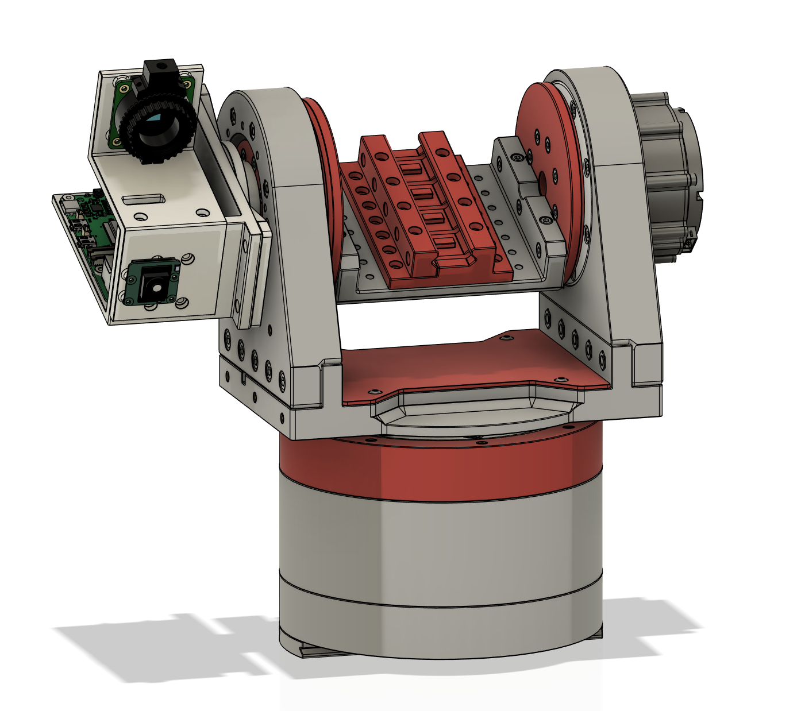

# Open Auto Turret

For deployment, automatic startup, web control and full-stack shutdown, use the
[station operating runbook](Firmware/docs/STATION_OPERATIONS.md).
The default mode is automatic roam/track; Manual/Hold is selected from the web.

On `rpi-turret`, from the checkout or release directory:

```bash
bash Firmware/scripts/run_application.sh deploy  # build/test/check an inactive checkout
bash Firmware/scripts/run_application.sh        # start in background
bash Firmware/scripts/run_application.sh status
bash Firmware/scripts/run_application.sh stop
```

Web: **http://rpi-turret:8080/**. See the runbook for deployment from Windows/Linux
without overwriting the Pi's existing files, and [the documentation map](Firmware/docs/README.md)
for architecture and measurement records.

## Zeroing in Action
[](https://www.youtube.com/watch?v=rVH_zREhYrE)

## Preview

