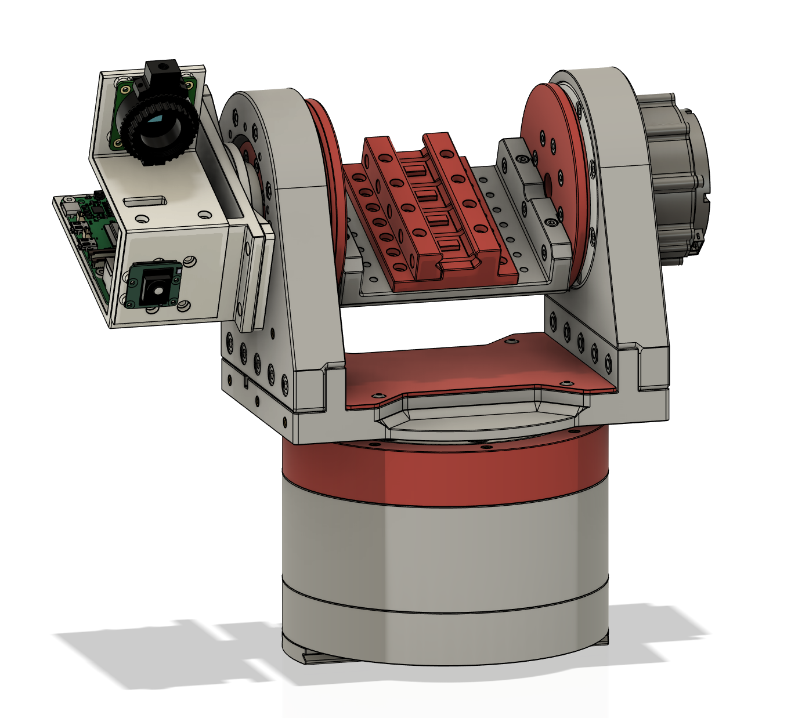

# Open Auto Turret

**Hardware refresh, 26 September 2026:** GM6020 continuous yaw on `can0`,
CyberGear pitch on `can1`, Waveshare dual-channel CAN FD HAT, IMX500 + IMX477
cameras, Hailo accelerator and I2C BNO085. See the
[verified inventory](Firmware/docs/HARDWARE_CURRENT.md),
[hardware adaptation plan](Firmware/docs/HARDWARE_ADAPTATION_PLAN.md), and
[people/head tracking plan](Firmware/docs/AI_HAT_PERCEPTION_PLAN.md).

The automatic station is stopped. Typed SocketCAN and a bounded yaw commissioning
path are implemented; [live probe results](Firmware/docs/HARDWARE_COMMISSIONING_2026_09_26.md)
confirm low-output motion in both directions. The automatic controller still
assumes two CyberGears and bounded yaw; **normal startup remains gated**.
Use the [station operating runbook](Firmware/docs/STATION_OPERATIONS.md) for
current inspection/shutdown and future deployment gates. The intended normal
mode remains automatic roam/track; Manual/Hold is selected from the web.

On `rpi-turret`, from the checkout or release directory:

```bash
bash Firmware/scripts/run_application.sh status
bash Firmware/scripts/run_application.sh check --commission-hardware  # new commissioning release
```

Web: **http://rpi-turret:8080/**. See the runbook for deployment from Windows/Linux
without overwriting the Pi's existing files, and [the documentation map](Firmware/docs/README.md)
for architecture and measurement records.

## Preview


